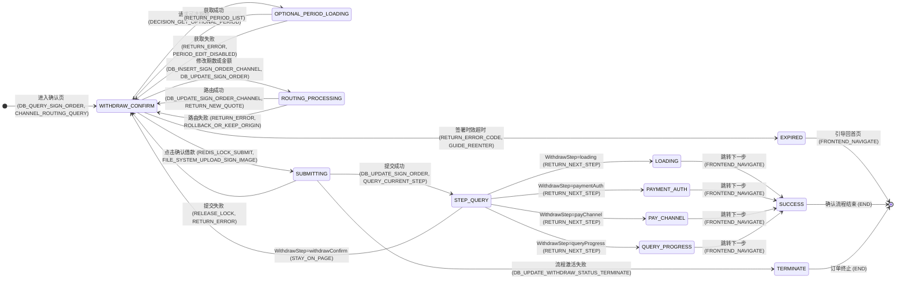

# intent-gate

**English** | [简体中文](README.zh-CN.md)

[](LICENSE)
[](https://www.python.org/)
[](https://modelcontextprotocol.io/)
[](https://pypi.org/project/intent-gate-mcp/)

**Stop AI coding agents from guessing.**

Complex business requirements. A thin or sloppy PRD. No legacy code to reference.
That is exactly where coding agents start inventing: "happy path only, no failure
flow", "idempotency with no server-side design" — gaps get silently filled with
plausible-looking guesses, and you find out far too late.

intent-gate moves intent alignment **before** coding, into the requirement-analysis
stage: a PRD goes through an intent-confidence gate → gaps are resolved through a
three-level funnel → the output is technically annotated Mermaid contracts (state
machines / sequence diagrams / decision tables) → a mechanical lint gate must reach
zero CRITICAL → only then is coding allowed to begin.

It runs as an **MCP server (stdio subprocess)** — plug-and-play with Claude Code and
other MCP clients. **No daemon, no credentials, zero config** — full workflow out of the box.

## Where it sits in a vibe-coding workflow

intent-gate owns exactly one stage of the pipeline, the requirement-analysis stage:

```
PRD ──▶ [ intent-gate: confidence gate → intent alignment → Mermaid contracts ]
          ──▶ summary.md (every edge technically annotated, lint CRITICAL = 0)
          ──▶ coding agent (Claude Code / Cursor / any agent) ──▶ tests ──▶ ship
```

The leverage is asymmetric: **if the contracts land well, the coding stage is a free
win** — every edge, step and rule already has a home, so any competent agent can
implement the spec. That is why intent-gate deliberately does NOT touch coding,
review or deployment: downstream agents are interchangeable; the input contract is not.

## A real run: the withdrawal confirmation page

What one real requirement looks like after a full intent-gate pass.

**The requirement, in one sentence:**

> "A withdrawal confirmation page — show the loan details, allow changing the term,
> sign and submit. Must be duplicate-proof, expiry-proof, and masked."
>
> That's it. Exactly where a coding agent starts guessing.

**What happened along the way:**

1. The analyzer drew the state machine first — and stalled at "submit": what about
   failure? Should duplicate protection live on the server or the frontend?
2. 🔴 Red-light questions were asked one at a time (≥3 mutually exclusive options):
   "How do you guard against double-submit on rapid clicks / refresh?"
3. You ruled: **"Server-side Redisson lock, wait 10s / lease 300s"** → your words
   were logged verbatim → injected into the state-machine edge and decision-table BR-01.
4. A mechanical lint gate ran before delivery: **CRITICAL = 0** or it does not ship.

**The output: a technically annotated Mermaid contract** (full state machine):



Every edge carries a mandatory technical-action annotation — the edge
`WITHDRAW_CONFIRM --> SUBMITTING` reads `(REDIS_LOCK_SUBMIT, FILE_SYSTEM_UPLOAD_SIGN_IMAGE)`.
What the coding agent receives is a spec, not an illustration.

**Decision table** (rule logic forced into a matrix — no "happy path only" survival):

| Rule | Condition | Action | Failure branch |
|---|---|---|---|
| BR-01 | Submit: lock `LOCK:withdraw:submit:{orderId}` conflict | Redisson lock serializes, concurrent submits rejected | Lock conflict → error code `DUPLICATE_SUBMIT` |
| BR-07 | Signing deadline `signExpireTime` | 5-minute double check: page countdown + server-side fallback on submit | Expired → `SIGN_EXPIRED`, guide re-entry |

The full contract: 10 business rules (BR-01..BR-10) + 3 sequence diagrams + an
intent-injection mapping table (15 Q&A rounds, every answer on record).

**The mechanical lint gate** (pre-delivery self-check report):

> `summary_lint: CRITICAL 0 / 2 findings total` (all MINOR, human-review class)
>
> - `[MINOR][L3]` state STEP_QUERY has 5 outgoing edges — confirm triggers are distinguishable
> - `[MINOR][L3]` state SUBMITTING has 3 outgoing edges — confirm triggers are distinguishable

With CRITICAL > 0 the contract refuses to ship and coding refuses to start — **this is
checked by code, not self-reported by the model.**

Same requirement without intent-gate (observed in our control run): the agent would front-end-disable the submit
button instead of designing a server-side distributed lock, hardcode a success page
instead of routing by `queryCurrentStep`, and never model the `EXPIRED` state at all.
The guessing space is structurally compressed, not politely discouraged.

## Where to put your PRD

intent-gate accepts **UTF-8 text files** or **.docx** (the dominant format for business requirements). Three ways to hand one over:

| Way | Example | Notes |
|---|---|---|
| Absolute path | `analyze D:\docs\withdraw-confirm.docx` | Most reliable; readable from anywhere |
| Relative path | `analyze docs/withdraw-confirm.md` | Resolved against the project root (`HG_WORKSPACE_ROOT`, defaults to the startup directory) |
| Conversation attachment | Drag the file into the chat; have the agent persist it first | Attachments are conversation content to the host, not a path — the agent must write them to disk before handing over a path |

**Supported formats:**

- ✅ UTF-8 text: `.md` / `.txt` / `.csv` / `.json` and similar
- ✅ `.docx`: **native support** — mammoth is a core dependency (installed automatically; tables become Markdown tables); if markitdown already exists in your environment (e.g. for another document MCP), it is reused for enhanced extraction
- ❌ Legacy `.doc` / `.pdf` / `.xlsx` and other binaries: convert first — Word「Save As → .docx or Plain Text (.txt)」, PDF export/save-as text

**Errors carry the next step**: missing file, binary format, and encoding failures each return a distinct message telling you what to do.

## Using it: what to say

Once installed, you drive it with plain language. This table is the whole manual:

| You say | Who picks it up | What happens |
|---|---|---|
| "分析这个需求 / analyze this PRD"（贴文档或指文件） | 🔴 Red team（`requirement-alignment`） | Reads the playbook first, runs the Step 0 confidence check, then asks you structured questions (≥3 options + "other"), one gap at a time |
| "画个状态机 / 生成 DDL" | 🔴 Red team | Same entry — pattern routing decides which diagrams your requirement actually needs |
| "继续"（中断后/新会话） | 🔴 Red team | Resumes from the on-disk ledger (`.harness/requests/{feature}/_review/`) — no session memory needed |
| 回答它的提问："1"，或 "4 余额不足一律拒绝" | the funnel | Answer logged verbatim → injected into the diagrams → settled with a precise landing point |
| "红蓝对抗 / blue-team review" —— **另开新会话说** | 🔵 Blue team（`red-blue-review`） | Independent adversarial review of the delivered summary: R1–R9 checks → findings with verdict PASS / FAIL-可整改 / FAIL-重做 |
| "按 findings 整改"（回到红军的会话里说） | 🔴 Red team revision discipline | Each finding settled into `revision-log.md` with a real landing point, lint re-runs to zero CRITICAL; anything conflicting with your earlier rulings comes back to you for a decision |
| 什么都不说，直接让它写代码 | SessionStart hook | The agent reads the landed `summary.md` contract before coding; `blocked` or lint-CRITICAL contracts refuse to be coded against |

Two rules worth remembering:

- **Answer its questions seriously** — every answer becomes part of the contract
  your coding agent will execute against.
- **The blue team needs a fresh session** — reviewing in the same session degrades
  adversarial review into self-check. Deliver with the red team, then open a new
  conversation and say "红蓝对抗".

## Core mechanisms

**Intent-confidence gate (Step 0)**: assess the light status before analyzing any
requirement. Until 🔴 core-logic gaps are eliminated, the report `status` must be
`blocked`, the first task in any breakdown is forced to be `[BLOCKER]`, and downstream
coding is forbidden from starting.

**Three-level alignment funnel (Step 0.5)** — cost decreases level by level, fully
non-blocking throughout:

```
① Code-grounded verification: technical gaps are checked against the code first;
  a unique ground truth is recorded directly, zero interpersonal cost
② AI-disclosed inference: registered with an explicit evidence chain, batch-confirmed
  by a human at session end (pure inference is forbidden on money-critical main flows)
③ Human ruling: structured-option questions (≥3 mutually exclusive options + "other"),
  one question at a time
```

**Mechanical enforcement (enforced by MCP tools, not by prompt self-discipline)**:

- Once a gap is registered it is physically persisted to `pending-questions.md`;
  until every box is ticked you don't get `intent_aligned_ready`;
- `resolve_question` mechanically rejects an empty landing point — every injected
  intent must be precise down to a state-machine edge, a sequence-diagram step, or a
  decision-table rule number; if no landing point is found, **closing the question is
  forbidden and it must be asked again**;
- Landing-point anchors may not be handwritten — the `draft_mapping` script locates
  real section/rule/step numbers;
- Pre-delivery `lint_summary` mechanical self-check (L0–L8: unparseable state machine
  (blind-guard) / missing terminal state / dead states / misplaced anchors / BR
  references / table read-write matrix…), **CRITICALs must reach zero before delivery**.

## Why confidence is read off artifacts

The obvious challenge: **"Claude Code can already generate Mermaid diagrams — even
generate code — why do I need your MCP?"**

Answer: **a model drawing a diagram is not intent alignment.** Intent confidence is
not the model's self-assessment — it is the closure state of artifacts.

Asking a model to rate "how sure are you" is a dead channel: verbal confidence barely
correlates with actual correctness (it's post-hoc rationalization, not a reading);
token-level logprobs can't reach semantic-layer uncertainty ("should there be an
intermediate state after a refund?") and the API doesn't expose them anyway. So this
system never asks the model for a score — **it makes the model produce, and reads the
confidence off the artifacts**.

Drawing diagrams (state machines / sequence diagrams / decision tables) is a
**measuring instrument, not a means of expression**: what natural language can fudge,
formalization cannot — "after the refund is processed, it's done" is one sentence, but
in a state machine you must answer whether REFUNDING has an outgoing edge, where it
points, and on what trigger. Every edge is a forced discrete decision; vague intent is
invisible in prose but a hole on an edge.

The difference between "Claude Code drawing it" and "the intent-gate host drawing it":
after Claude Code draws, nobody verifies — intent gaps stay on the diagram as-is;
after intent-gate draws, the output must pass lint, every gap goes through alignment,
and a human rules on each one — **every cell of the artifact is closed**.

Gaps come in four kinds, each with its own detector — "can't draw it" is only layer one:

| Layer | Mechanism | What it catches |
|---|---|---|
| ① Forced formalization | Draw the diagram; mark wherever you can't | **Perceived gaps** — the model knows it doesn't know |
| ② Taxonomy sweep | A nine-category ambiguity checklist (exception paths / rollback / condition combinations / field semantics / idempotency & privilege / terminology…) | **Semi-silent gaps** — the model won't stall on its own, but sweeping element-by-element with the checklist exposes them |
| ③ Mechanical lint | L1 no successful terminal state / L2 dead states / L6 table has no writes… | **Fully silent gaps** — places the model filled in without any awareness; enforced by code, zero reliance on self-discipline |
| ④ Blue-team independent review | Independent session + information diet (optional skill) | **Systematic blind spots of the author's attention** — layers ①–③ are the same pair of eyes; this one swaps in a fresh pair |

So a 🟢 green light doesn't mean "the model feels confident" — it means "every edge of
the state machine is grounded, all nine minefields swept, lint CRITICALs at zero, and a
human has ruled on every gap." **Confidence is a property of the graph, not of the
model.** Drawing is the instrument, lint is the calibrator, human rulings are the
reference source.

## Optional add-ons

- **Red-blue adversarial review** (`red-blue-review` skill): after a complex
  requirement's summary is delivered, optionally open an independent session — the
  blue team reads only the artifacts, not the red team's reasoning (information diet),
  runs the R1–R9 checks, and produces findings that drive a gated rectification loop.
  `approved` comes via exactly two paths — a blue-team PASS or a direct human ruling;
  the red team never self-grants. Circuit breaker: at most 2 rounds, still FAIL →
  `ESCALATE` to a human.
- **DingTalk group consensus channel** (sister project
  [intent-gate-service](https://github.com/baixinghao/intent-gate-service), a standalone
  MCP service): business gaps belong to business people, technical gaps to technical
  people — funnel level ③ can post to a DingTalk group @ the right role; replies land
  in the inbox via callback. The real value of the group channel is **the paper trail**:
  answers carry a staffId and the original wording and are publicly visible —
  **no objection in the group ≈ consensus**. The main plugin defaults to the `single`
  channel, zero config.
- **Contract-driven coding** (`contract-coding` skill): an **addendum layer** for the
  coding phase — when a requirement's contract exists
  (`.harness/requests/{feature}/summary.md`), code is generated FROM the mermaid
  contract (every edge/rule maps to an implementation anchor), and drift stops the
  line: the contract gets amended first, then the code follows. It layers on top of
  your own coding skills / superpowers and never replaces them — your project keeps
  full ownership of HOW to write code; this skill only owns contract fidelity.

## Environment requirements

| Item | Requirement | Notes |
|---|---|---|
| Python | ≥ 3.11 | [python.org](https://www.python.org/downloads/); pipx/uv manage an isolated environment |
| Package manager | `pipx` or `uv` | [Install pipx](https://pipx.pypa.io/stable/installation/) / [Install uv](https://docs.astral.sh/uv/getting-started/installation/) |
| OS | Windows / macOS / Linux | On Windows, the plugin's SessionStart injection needs [Git Bash](https://gitforwindows.org/) (skipped silently when missing; everything else keeps working) |
| MCP client | Any MCP-capable client | Claude Code / Cursor / VS Code etc.; the skills/hooks plugin form is currently Claude Code-specific |

**Dependencies** (installed automatically — nothing manual):

| Package | Purpose |
|---|---|
| `mcp>=1.10,<2.0` | MCP protocol (FastMCP 1.x) |
| `pydantic>=2.6` / `pydantic-settings>=2.2` | Configuration & validation |
| `mammoth>=1.11` | .docx parsing engine (only dependency is cobble, pure Python, no onnxruntime) |

Optional enhancement: if `markitdown` is already in your environment (e.g. installed for another document MCP), it is reused automatically for finer table/merged-cell extraction; otherwise mammoth handles it.

## Quick start (Claude Code — two steps)

```bash
# 1) Install the MCP server — the enforcement half (tools, ledger, lint gates)
#    .docx is natively supported: mammoth is a core dependency, installed
#    automatically with the package — no extra required
pipx install intent-gate-mcp
# or: uv tool install intent-gate-mcp

# 2) Install the plugin — skills + hooks, auto-registers the MCP server
claude plugin marketplace add baixinghao/intent-gate
claude plugin install intent-gate@baixinghao-plugins
```

Restart your session. Done — entry discipline is auto-injected and the MCP tools
are live.

> ⚠️ **Step 1 is not optional.** The plugin's skills are discipline; the MCP server
> is enforcement. A plugin-only install (no `intent-gate` command on PATH) leaves you
> with good advice and zero mechanical gates — no question ledger, no lint, no
> delivery blocking. The SessionStart hook self-checks at every session start:
> if the server is missing, your agent will tell you to run step 1.

## Environment variables

| Variable | Default | Description |
|---|---|---|
| `HG_WORKSPACE_ROOT` | `.` (startup directory) | Project root (where `.harness` lives); relative PRD paths resolve against it |
| `HG_LOG_LEVEL` | `INFO` | Log level (DEBUG / INFO / WARNING / ERROR) |
| `HG_CHANNEL` | `single` | Intent-alignment channel; only `single` (dialog fallback) is supported — the DingTalk group channel lives in the sister project intent-gate-service |

Every variable has a default — **zero config to use**; copy `.env.example` to `.env` only when you want to adjust.

## Other MCP clients / agents

**Support matrix:**

| Host | Status |
|---|---|
| Claude Code（plugin 全量：skills + hooks + MCP） | ✅ Stable——主战场，全量测试覆盖 |
| Cursor / Codex（`install --target` 纪律注入） | 🧪 Beta——合并/幂等逻辑有单元测试与构建验证，hook 契约依据官方文档；尚未经长会话实战，[欢迎反馈](https://github.com/baixinghao/intent-gate/issues) |
| 其他 MCP 客户端（mcpServers 配置） | 🤝 社区验证——协议标准，配置形状已核实 |

The enforcement half — tools, question ledger, lint gates, and the
`doc_analysis_playbook` prompt — is plain MCP and works in any client that
supports MCP prompts. Only the skills/hooks half is Claude Code-specific.

After step 1 (`pipx`/`uv tool install intent-gate-mcp`), register one way:

**One-liners (agents that provide a CLI):**

```bash
claude mcp add intent-gate -- intent-gate                          # Claude Code
kimi mcp add --transport stdio intent-gate -- intent-gate          # Kimi CLI
codex mcp add intent-gate -- intent-gate                           # Codex CLI
```

**Config files:**

| Agent | Config file | Root key |
|---|---|---|
| Cursor | `.cursor/mcp.json`（项目）/ `~/.cursor/mcp.json`（全局） | `mcpServers` |
| Windsurf | `~/.codeium/windsurf/mcp_config.json` | `mcpServers` |
| Gemini CLI | `~/.gemini/settings.json` / `.gemini/settings.json` | `mcpServers` |
| Kimi CLI | `~/.kimi/mcp.json` | `mcpServers` |
| VS Code (Copilot) | `.vscode/mcp.json` | `servers` ⚠️ |
| Codex CLI | `~/.codex/config.toml` | `[mcp_servers.*]` ⚠️ |

All `mcpServers`-style clients share one shape:

```json
{
  "mcpServers": {
    "intent-gate": {
      "command": "intent-gate"
    }
  }
}
```

VS Code — note the different root key and the required `type`:

```json
{
  "servers": {
    "intent-gate": {
      "type": "stdio",
      "command": "intent-gate"
    }
  }
}
```

Codex CLI — TOML, and the table name must be `mcp_servers` with an
underscore (`mcp-servers` is silently ignored):

```toml
[mcp_servers.intent-gate]
command = "intent-gate"
```

**Discipline injection beyond Claude Code:** the SessionStart hook (entry
discipline auto-injected at every session start) is host-agnostic. After
installing the server, wire it into your agent's hooks config with one
command — merge-only, idempotent, and `uninstall --target` reverts it:

```bash
intent-gate install --target cursor   # writes ~/.cursor/hooks.json
intent-gate install --target codex    # appends to ~/.codex/config.toml
```

Whatever the client, start by asking the agent to read the MCP prompt
`doc_analysis_playbook` in full — it is the law, and it ships with the
server, not with any plugin. (Clients without MCP-prompt support can point
the agent at `src/intent_gate/analysis/playbook.md` instead.)

If your client speaks a network transport, expose MCP over **SSE** with
`intent-gate --mcp-transport sse --mcp-port 8400`.

**All intent-alignment capabilities work with zero configuration** (single channel,
chat dialog as fallback).

## Notes

- **Document-parsing boundary**: .docx only; `.doc` legacy / `.pdf` / `.xlsx` and other binaries must be converted first (Word「Save As → .docx or Plain Text (.txt)」, PDF export/save-as text)
- The MCP server is generic (stdio/SSE, works with any MCP client); the **skills/hooks plugin form is currently Claude Code-specific** — other clients get the server half only
- The ledger lives under `{workspace_root}/.harness/requests/` and is tracked by git — add a `.gitignore` entry if you don't want it committed

## Development (from a clone)

```bash
python -m venv .venv
source .venv/bin/activate        # Windows: .venv\Scripts\activate
pip install -e .
python -m unittest discover -s tests -v   # core-logic tests (no credentials needed)
```

Point `command` at the virtualenv interpreter:
`"command": "<repo>\\.venv\\Scripts\\python.exe", "args": ["-m", "intent_gate"]`
(on macOS/Linux: `<repo>/.venv/bin/python`), and set
`"env": { "PYTHONPATH": "<repo>\\src" }`.
Plugin-form skeleton: see [docs/PLUGIN.md](docs/PLUGIN.md).

## Project structure

```
src/intent_gate/
├── config.py / logging.py        # config (HG_* env vars, zero credentials), logging
├── models.py / security.py       # pure-stdlib core: tokens, allowlist, reply parsing, rate limiting
├── __main__.py                   # MCP entrypoint (stdio/SSE)
├── alignment/                    # intent-alignment subsystem (file-in-the-loop, non-blocking)
│   ├── store.py                  #   persistence: pending list / alignment log / inference list / inbox
│   ├── manager.py                #   business layer + contract functions (register_question /
│   │                             #   file_inbound_reply, reused by sister project intent-gate-service)
│   └── tools.py                  #   MCP tool registration (9 intent-alignment tools)
├── analysis/                     # requirement-analysis subsystem
│   ├── playbook.md               #   requirement-analysis playbook (distributed in full via MCP prompt)
│   ├── engine.py                 #   gap adjudication / host-judgment bookkeeping
│   ├── lint.py                   #   mechanical checker for analysis reports (L0-L8 + three matrices)
│   ├── mapper.py                 #   anchor locating for the intent-injection mapping table
│   └── tools.py                  #   MCP tool registration (analysis tools + playbook prompt)
skills/
├── using-intent-gate/            # entry discipline: when to escalate, where the optional capabilities live
├── requirement-alignment/        # intent-alignment workflow outline → points to the MCP prompt
├── contract-coding/              # coding-phase addendum: code generated FROM the mermaid contract, layers over your own coding skills
└── red-blue-review/              # optional: red-blue adversarial review playbook (blue-team nine checks + red-team rectification discipline)
(sister repo) intent-gate-service # DingTalk group channel + decision gates (standalone MCP service)
```

## Documentation

- [docs/STRUCTURE.md](docs/STRUCTURE.md) — **structure & usage guide (file-by-file across both repos; read this first)**
- [docs/DESIGN.md](docs/DESIGN.md) — intent-alignment subsystem design (three-level funnel, file contract, sister-project split)
- [docs/ARCHITECTURE.md](docs/ARCHITECTURE.md) — architecture decisions (layering, long-connection trade-offs, failure posture)
- [intent-gate-service README](https://github.com/baixinghao/intent-gate-service) — sister-project DingTalk configuration and integration

## Roadmap

- [ ] Coding-start gate: `claim_task` validates `approved` + injects contract slices (the last mile of intent alignment)
- [ ] intent-gate-service: interactive cards + button callbacks (no text parsing needed)
- [ ] intent-gate-service: gate audit persistence (SQLite) and replay
- [ ] intent-gate-service: gateway mode for multi-agent instances (stream inbound converged into a single connection)

## License

[MIT](LICENSE)
