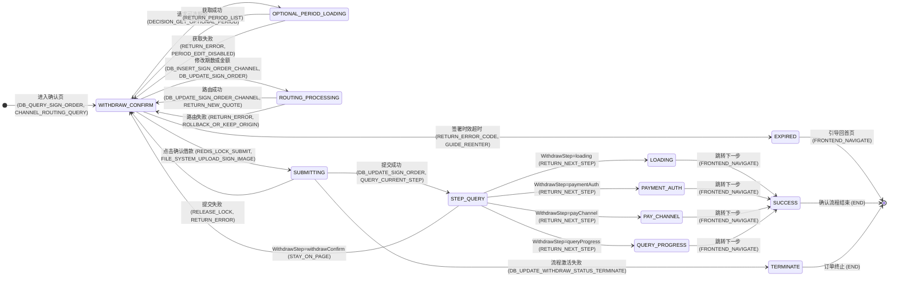

# intent-gate

[English](README.md) | **简体中文**

[](LICENSE)
[](https://www.python.org/)
[](https://modelcontextprotocol.io/)
[](https://pypi.org/project/intent-gate-mcp/)

**别让编码 agent 猜需求。**

复杂业务需求、质量堪忧的 PRD、没有旧代码可参考——这正是编码 agent 开始编造的地方：
"只有成功没有失败流""防重复无服务端方案"这类断层，会被顺手猜一个合理实现混过去，
等你发现时往往已经晚了。

intent-gate 把意图对齐**前置到需求解析阶段**：PRD 先过意图置信度门禁 → 断层按三级
漏斗消解 → 产出带技术打标的 mermaid 契约（状态机/时序图/决策表）→ lint 机械门禁
CRITICAL 归零 → 才允许编码开工。

以 **MCP server（stdio 子进程）** 形态运行，Claude Code 等即插即用；
**无常驻、无凭据、零配置**，跑通全流程。

## 它在 vibe coding 工作流里的位置

intent-gate 只占管线的一个阶段：需求解析。

```
PRD ──▶【intent-gate：置信度门禁 → 意图对齐 → mermaid 契约】
         ──▶ summary.md（每条边带技术打标，lint CRITICAL 归零）
         ──▶ 编码 agent（Claude Code / Cursor / 谁都行）──▶ 测试 ──▶ 交付
```

杠杆是不对称的：**契约落得好，编码阶段就是白给的**——每条边、每个步骤、每条规则
都有了着落，换个像样的 agent 都能实现。所以 intent-gate 刻意不碰编码/评审/部署：
下游 agent 是可替换的，输入契约不可替代。

## 真实实践：提现确认页

一个真实需求走完 intent-gate 全流程的样子。

**需求一句话**：

> 「提现确认页——展示借款信息、可修改期数、签名提交。要求防重、防过期、脱敏。」
>
> 没有更多细节。这正是编码 agent 开始猜的地方。

**过程中发生了什么**：

1. 分析器先画状态机，在「提交」处卡住：失败怎么办？防重在服务端还是前端？
2. 🔴 红灯题逐题问你（一次一个，≥3 个互斥选项）：「连点 / 刷新重提如何防？」
3. 你拍板：「服务端 Redisson 锁，wait 10s / lease 300s」→ 原话逐字落账 → 注入状态机边与决策表 BR-01
4. 交付前 lint 机械自检：**CRITICAL 0** 才放行。

**产出：带技术打标的 mermaid 契约**（完整状态机）：



每条边都强制带技术动作打标——`WITHDRAW_CONFIRM --> SUBMITTING` 写着
`(REDIS_LOCK_SUBMIT, FILE_SYSTEM_UPLOAD_SIGN_IMAGE)`。编码 agent 拿到的是规格，不是示意图。

**决策表**（规则逻辑强制成矩阵，防"只有成功路径"）：

| 规则编号 | 条件 | 动作 | 异常分支 |
|---|---|---|---|
| BR-01 | 提交借款：`LOCK:withdraw:submit:{orderId}` 锁冲突 | Redisson 锁串行化，同单并发拒绝 | 锁冲突 → 错误码 `DUPLICATE_SUBMIT` |
| BR-07 | 签署时效 `signExpireTime` | 5 分钟双保险：页面倒计时 + 提交时服务端兜底 | 过期 → `SIGN_EXPIRED`，引导重进 |

完整契约：10 条业务规则（BR-01~BR-10）+ 3 张时序图 + 意图注入映射表（15 条问答全部留痕）。

**lint 机械门禁**（交付前自检报告）：

> `summary_lint：CRITICAL 0 / 共 2 条`（全部 MINOR 人工复核类）
>
> - `[MINOR][L3]` 状态 STEP_QUERY 有 5 条出边，需人工确认触发条件可区分
> - `[MINOR][L3]` 状态 SUBMITTING 有 3 条出边，需人工确认触发条件可区分

CRITICAL 未归零，契约不许交付、编码不许开工——**这是代码检查的，不是模型自报的。**

**同一个需求，没有 intent-gate 时**（对照组实测）：

| 维度 | 没有 intent-gate，agent 会猜 | 契约里写死的 |
|---|---|---|
| 防重 | 前端按钮置灰防连点 | 服务端分布式锁 `LOCK:withdraw:submit:{orderId}`（BR-01） |
| 提交后分流 | 前端写死跳成功页 | 按 `queryCurrentStep` 返回的 `{withdrawStep, url}` 动态跳转 |
| 失败流 | 只有成功路径，"失败？不会发生" | `SUBMITTING` 三条出边：可重试回确认页 / `TERMINATE` 终止 / 成功进 `STEP_QUERY` |
| 过期 | 没想到 | `EXPIRED` 状态 + 5 分钟双保险 + `SIGN_EXPIRED` 错误码（BR-07） |

## 把 PRD 放在哪里

intent-gate 的输入是 **UTF-8 文本文件** 或 **.docx**（Word 需求文档的主力格式）。三种给法：

| 给法 | 示例 | 说明 |
|---|---|---|
| 绝对路径 | `分析需求 D:\docs\提现确认.docx` | 最稳，任何位置都能读 |
| 相对路径 | `分析需求 docs/提现确认.md` | 相对项目根（`HG_WORKSPACE_ROOT`，默认启动目录）解析 |
| 对话附件 | 把文档拖进对话，让 agent 先落盘再分析 | 附件在宿主手里是内容不是路径，agent 落盘后才能传 |

**支持格式**：

- ✅ UTF-8 文本：`.md` / `.txt` / `.csv` / `.json` 等
- ✅ `.docx`：**原生支持**——mammoth 是核心依赖（安装自动带上，表格转 Markdown 表格）；若环境已有 markitdown（如配合其他文档 MCP），自动复用增强
- ❌ `.doc` 老格式 / `.pdf` / `.xlsx` 等二进制：请先转文本——Word「另存为 → .docx 或 纯文本(.txt)」，PDF 导出/另存为文本

**报错即指引**：文件不存在 / 二进制 / 编码错误分别返回带下一步的报错，照做即可。

## 怎么用：张嘴说什么

装完之后全靠大白话驱动。这张表就是全部说明书：

| 你说 | 谁接活 | 发生什么 |
|---|---|---|
| "分析这个需求 / 帮我解析这个 PRD"（贴文档或指文件） | 🔴 红军（`requirement-alignment`） | 先读 playbook，跑 Step 0 置信度评估，然后逐题向你结构化提问（≥3 选项 + "其他"），一次一个断层 |
| "画个状态机 / 生成 DDL" | 🔴 红军 | 同一个入口——型态路由自动判定你的需求需要哪几张图 |
| "继续"（中断后/新会话） | 🔴 红军 | 从磁盘账本（`.harness/requests/{需求名}/_review/`）续跑，不依赖会话记忆 |
| 回答它的提问："1"，或 "4 余额不足一律拒绝" | 对齐漏斗 | 原话逐字落账 → 注入图/规则 → 带精确落点核销 |
| "红蓝对抗 / 蓝军评审"——**另开新会话说** | 🔵 蓝军（`red-blue-review`） | 对已交付的 summary 做独立对抗评审：R1-R9 九项检查 → findings，结论 PASS / FAIL-可整改 / FAIL-重做 |
| "按 findings 整改"（回到红军的会话里说） | 🔴 红军整改纪律 | 每条 finding 落进 `revision-log.md`（整改动作 + 真实落点），lint 重跑 CRITICAL 归零；与你之前拍板冲突的，端回来请你裁决 |
| 什么都不说，直接让它写代码 | SessionStart hook | 编码前 agent 自动读已落地的 `summary.md` 契约；`blocked` 或 lint 带 CRITICAL 的契约拒绝被编码 |

两条值得记住的规矩：

- **认真回答它的提问**——你的每个答案都会变成编码 agent 要执行的契约的一部分。
- **蓝军必须另开新会话**——同会话评审会退化成自查。红军交付完，开个新对话，说一声"红蓝对抗"。

## 核心机制

**意图置信度门禁（Step 0）**：分析任何需求前先评估灯态。🔴 核心逻辑断层未消除前，
报告 `status` 必须 `blocked`，任务拆分首任务强制 `[BLOCKER]`，禁止下游编码开工。

**三级对齐漏斗（Step 0.5）**，逐级降本，全程非阻塞：

```
① 代码实证：技术类断层先查代码，有唯一 ground truth 直接落账，零人际成本
② AI 公示推断：带显式依据链登记，会话末批量请人类点头（资金主流程禁止纯推断）
③ 人工拍板：结构化选项提问（≥3 互斥选项 + "其他"），一次一题
```

**机械执法（MCP 工具强制，不靠 prompt 自觉）**：

- 断层一旦登记物理落盘 `pending-questions.md`，勾不打完不给 `intent_aligned_ready`；
- `resolve_question` 空落点机械拒收——每条注入意图必须精确到状态机的边、时序图的
  步骤、决策表的规则号，找不到落点**禁止核销，必须回问**；
- 落点锚点禁止手写，`draft_mapping` 脚本真实定位章节号/规则号/步骤号；
- 交付前 `lint_summary` 机械自检（L0-L8：状态机解析失明兜底/成功终态/死状态/
  锚点错位/BR 引用/表读写矩阵……），**CRITICAL 归零才可交付**。

## 意图置信度为什么从产物上读

最直接的质疑是：**「Claude Code 自己就能生成 mermaid 图，甚至直接生成代码，
干嘛要你的 MCP？」**

答案：**模型会画图 ≠ 意图对齐发生了。** 意图置信度不是模型的自我感觉，是
**artifact 的闭合状态**。

让模型自评"有几分把握"是条死通道：口头置信度和真实正确率几乎不相关（那是事后
合理化，不是读数）；token 级 logprobs 够不着语义层的不确定（"退款后到底该不该有
中间态"），且 API 根本不暴露。所以本系统从头到尾不让模型打分数——**让它生产，
从产物上读数**。

画图（状态机/时序图/决策表）是**探测仪器**，不是表达手段：自然语言能糊弄过去的，
形式化糊弄不过去——"退款处理完就结束了"是一句话，状态机里你必须回答 REFUNDING
之后有没有边、指向谁、触发条件是什么；每一条边都是一次被迫的离散决策，模糊意图
在散文里是隐形的，在边上是空洞。

同样一句话，由 Claude Code 自己画和由 intent-gate 的宿主画，差别在于：
Claude Code 画完没人校验，意图断层原样留在图上；intent-gate 画完要过 lint、
要逐题对齐、要人类拍板——**产出的每一格都是闭合的**。

断层分四种，各有探测器，"画不下去"只是第一层：

| 层 | 机制 | 抓什么 |
|---|---|---|
| ① 形式化强迫 | 画图，画不下去就标记 | **有感知的断层**——模型知道自己不知道 |
| ② 分类学扫雷 | 九类歧义点清单（异常路径/回滚/条件组合/字段语义/防重越权/术语…） | **半沉默断层**——模型不会自发卡住，但拿清单逐元素扫时会暴露 |
| ③ 机械 lint | L1 无成功终态 / L2 死状态 / L6 表无写入… | **全沉默断层**——模型毫无知觉地填上的地方，代码执法，完全不靠自觉 |
| ④ 蓝军独立复核 | 独立 session + 信息节食（可选 skill） | **作者注意力的系统性盲区**——前三层是同一双眼睛，这层换一双 |

所以 🟢 绿灯的含义不是"模型觉得有把握"，而是"状态机每条边有据、九类雷区扫过、
lint CRITICAL 归零、人类对断层逐题拍板"。**置信度是图的属性，不是模型的属性。**
画图是仪器，lint 是校准器，人类拍板是基准源。

## 可选能力

- **红蓝对抗评审**（`red-blue-review` skill）：complex 需求交付后，可选开一个
  独立 session 做对抗审查——蓝军只读产物不看推理（信息节食），按 R1-R9 九项检查
  产出 findings 驱动整改；`approved` 只有蓝军 PASS 或人类直接拍板两条路，红军
  永远不自授。熔断最多 2 轮，仍 FAIL 标 `ESCALATE` 交人类。
- **钉钉群共识通道**（姊妹篇 [intent-gate-service](https://github.com/baixinghao/intent-gate-service)，独立 MCP 服务）：
  业务断层归业务人员、技术断层归技术人员——漏斗第③级可发钉钉群 @对应角色，
  回复经回调落盘 inbox 领取。群通道的价值是**留痕**：回答带 staffId、带原话、
  公开可见，**群里无人反驳 ≈ 共识**。主插件默认 single 通道，零配置即用。

## 环境要求

| 项 | 要求 | 说明 |
|---|---|---|
| Python | ≥ 3.11 | [python.org](https://www.python.org/downloads/)；pipx/uv 会管理独立环境 |
| 包管理器 | `pipx` 或 `uv` 任一 | [pipx 安装](https://pipx.pypa.io/stable/installation/) / [uv 安装](https://docs.astral.sh/uv/getting-started/installation/) |
| 操作系统 | Windows / macOS / Linux | Windows 的插件 SessionStart 注入需 [Git Bash](https://gitforwindows.org/)（缺省时静默跳过，其余功能不受影响） |
| MCP 客户端 | 支持 MCP 的任一客户端 | Claude Code / Cursor / VS Code 等；skills/hooks 插件形态目前为 Claude Code 定制 |

**依赖包**（安装时自动带上，无需手动安装）：

| 包 | 用途 |
|---|---|
| `mcp>=1.10,<2.0` | MCP 协议（FastMCP 1.x） |
| `pydantic>=2.6` / `pydantic-settings>=2.2` | 配置与校验 |
| `mammoth>=1.11` | .docx 解析引擎（唯一依赖 cobble，纯 Python，无 onnxruntime） |

可选增强：环境里已有 `markitdown`（如配合其他文档 MCP 安装的）→ 自动复用，docx 表格/合并单元格提取更精细；无则走 mammoth。

## 快速开始（Claude Code —— 两步）

```bash
# 1）装 MCP server —— 执法的那一半（工具/账本/lint 门禁）
#    .docx 原生支持：mammoth 是核心依赖，安装时自动带上，无需任何 extra
pipx install intent-gate-mcp
# 或：uv tool install intent-gate-mcp

# 2）装插件 —— skills + hooks，自动注册 MCP server
claude plugin marketplace add baixinghao/intent-gate
claude plugin install intent-gate@baixinghao-plugins
```

重启会话，完事——入口纪律自动注入，MCP 工具面在线。

> ⚠️ **第 1 步不可省。** 插件的 skill 是纪律，MCP server 才是执法。只装插件
> （PATH 里没有 `intent-gate` 命令）= 只剩嘴上劝告，机械门禁全部阵亡——
> 没有问题账本、没有 lint、没有交付拦截。SessionStart hook 每局自检：
> 发现 server 缺席，agent 会主动提醒你去跑第 1 步。

## 环境变量

| 变量 | 默认值 | 说明 |
|---|---|---|
| `HG_WORKSPACE_ROOT` | `.`（启动目录） | 项目根目录（`.harness` 所在）；PRD 相对路径按它解析 |
| `HG_LOG_LEVEL` | `INFO` | 日志级别（DEBUG / INFO / WARNING / ERROR） |
| `HG_CHANNEL` | `single` | 意图对齐通道；仅支持 `single`（对话框兜底），钉钉群通道在姊妹篇 intent-gate-service |

全部变量都有默认值，**零配置即可使用**；需要调整时复制 `.env.example` 为 `.env`。

## 其他 MCP client / agent

**支持分级：**

| 宿主 | 状态 |
|---|---|
| Claude Code（plugin 全量：skills + hooks + MCP） | ✅ Stable——主战场，全量测试覆盖 |
| Cursor / Codex（`install --target` 纪律注入） | 🧪 Beta——合并/幂等逻辑有单元测试与构建验证，hook 契约依据官方文档；尚未经长会话实战，[欢迎反馈](https://github.com/baixinghao/intent-gate/issues) |
| 其他 MCP 客户端（mcpServers 配置） | 🤝 社区验证——协议标准，配置形状已核实 |

执法的那一半——工具、问题账本、lint 门禁、`doc_analysis_playbook` prompt——
是标准 MCP，任何支持 MCP prompt 的客户端都能全量使用；
只有 skills/hooks 那一半是 Claude Code 专属。

跑完第 1 步（`pipx`/`uv tool install intent-gate-mcp`）后，任选一种注册方式：

**一行命令（agent 自带 CLI 的）：**

```bash
claude mcp add intent-gate -- intent-gate                          # Claude Code
kimi mcp add --transport stdio intent-gate -- intent-gate          # Kimi CLI
codex mcp add intent-gate -- intent-gate                           # Codex CLI
```

**配置文件：**

| Agent | 配置文件 | 根键 |
|---|---|---|
| Cursor | `.cursor/mcp.json`（项目）/ `~/.cursor/mcp.json`（全局） | `mcpServers` |
| Windsurf | `~/.codeium/windsurf/mcp_config.json` | `mcpServers` |
| Gemini CLI | `~/.gemini/settings.json` / `.gemini/settings.json` | `mcpServers` |
| Kimi CLI | `~/.kimi/mcp.json` | `mcpServers` |
| VS Code (Copilot) | `.vscode/mcp.json` | `servers` ⚠️ |
| Codex CLI | `~/.codex/config.toml` | `[mcp_servers.*]` ⚠️ |

所有 `mcpServers` 风格的客户端共用一个形态：

```json
{
  "mcpServers": {
    "intent-gate": {
      "command": "intent-gate"
    }
  }
}
```

VS Code 注意根键不同且必须带 `type`：

```json
{
  "servers": {
    "intent-gate": {
      "type": "stdio",
      "command": "intent-gate"
    }
  }
}
```

Codex CLI 用 TOML，表名必须是下划线的 `mcp_servers`（写成 `mcp-servers` 会被静默忽略）：

```toml
[mcp_servers.intent-gate]
command = "intent-gate"
```

**Claude Code 之外的纪律注入**：SessionStart hook（每局开场自动注入入口纪律）
本身与宿主无关。装好 server 后，一条命令接进你的 agent 的 hooks 配置——
只合并不覆盖、幂等，`uninstall --target` 可拆线：

```bash
intent-gate install --target cursor   # 写入 ~/.cursor/hooks.json
intent-gate install --target codex    # 追加到 ~/.codex/config.toml
```

不管哪个客户端，开局先让 agent 完整读一遍 MCP prompt
`doc_analysis_playbook`——它是法律，随 server 分发，不依赖任何插件。
（客户端不支持 MCP prompt 的，让 agent 直接读
`src/intent_gate/analysis/playbook.md`，同一份文本。）

客户端走网络协议的话，用 `intent-gate --mcp-transport sse --mcp-port 8400`
以 **SSE** 暴露 MCP。

**零配置即可使用全部意图对齐能力**（single 通道，对话框兜底）。

## 备注

- **文档解析边界**：只支持 .docx；`.doc` 老格式 / `.pdf` / `.xlsx` 等二进制请先转文本（Word「另存为 → .docx 或 纯文本(.txt)」，PDF 导出/另存为文本）
- MCP server 通用（stdio/SSE，任何 MCP 客户端可挂）；**skills/hooks 插件形态目前为 Claude Code 定制**——其他客户端只有 server 一半
- 账本写在 `{workspace_root}/.harness/requests/` 下，会被 git 跟踪——介意入库请加 `.gitignore`

## 开发（克隆仓库）

```bash
python -m venv .venv && .venv\Scripts\activate   # Unix: source .venv/bin/activate
pip install -e .
python -m unittest discover -s tests -v   # 核心逻辑测试（无需任何凭据）
```

把 `command` 指向虚拟环境解释器：
`"command": "<repo>\\.venv\\Scripts\\python.exe", "args": ["-m", "intent_gate"]`，
并设 `"env": { "PYTHONPATH": "<repo>\\src" }`。
插件形态骨架见 [docs/PLUGIN.md](docs/PLUGIN.md)。

## 项目结构

```
src/intent_gate/
├── config.py / logging.py        # 配置（HG_* 环境变量，零凭据）、日志
├── models.py / security.py       # 纯 stdlib 核心：token、白名单、回复解析、限流
├── __main__.py                   # MCP 入口（stdio/SSE）
├── alignment/                    # 意图对齐子系统（file-in-the-loop，非阻塞）
│   ├── store.py                  #   落盘层：待决清单/alignment-log/推断清单/inbox
│   ├── manager.py                #   业务层 + 契约函数（register_question /
│   │                             #   file_inbound_reply，姊妹篇 intent-gate-service 复用）
│   └── tools.py                  #   MCP 工具注册（9 个意图对齐工具）
├── analysis/                     # 需求分析子系统
│   ├── playbook.md               #   需求分析 playbook（经 MCP prompt 全文分发）
│   ├── engine.py                 #   现场判定 / 宿主判断落账
│   ├── lint.py                   #   分析报告机械检查器（L0-L8 + 三矩阵）
│   ├── mapper.py                 #   意图注入映射表锚点定位
│   └── tools.py                  #   MCP 工具注册（分析工具 + playbook prompt）
skills/
├── using-intent-gate/             # 入口纪律：何时升级人工、两个可选能力的位置
├── requirement-alignment/        # 意图对齐工作流纲要 → 指向 MCP prompt
└── red-blue-review/              # 可选：红蓝对抗评审 playbook（蓝军九项检查 + 红军整改纪律）
（姊妹仓）intent-gate-service      # 姊妹篇：钉钉群通道 + 决策闸门（独立 MCP 服务）
```

## 文档

- [docs/STRUCTURE.md](docs/STRUCTURE.md) — **结构说明 & 使用说明（双仓逐文件，先看这份）**
- [docs/DESIGN.md](docs/DESIGN.md) — 意图对齐子系统设计（三级对齐漏斗、文件契约、姊妹篇分工）
- [docs/ARCHITECTURE.md](docs/ARCHITECTURE.md) — 架构决策（分层、长连接取舍、失败姿态）
- [intent-gate-service README](https://github.com/baixinghao/intent-gate-service) — 姊妹篇钉钉配置与接入

## Roadmap

- [ ] 编码开工闸门：claim_task 校验 approved + 注入契约切片（意图对齐的最后一公里）
- [ ] intent-gate-service：互动卡片 + 按钮回调（免文本解析）
- [ ] intent-gate-service：闸门审计落盘（SQLite）与回放
- [ ] intent-gate-service：多 agent 实例的网关模式（stream 入站收敛为单连接）

## License

[MIT](LICENSE)
