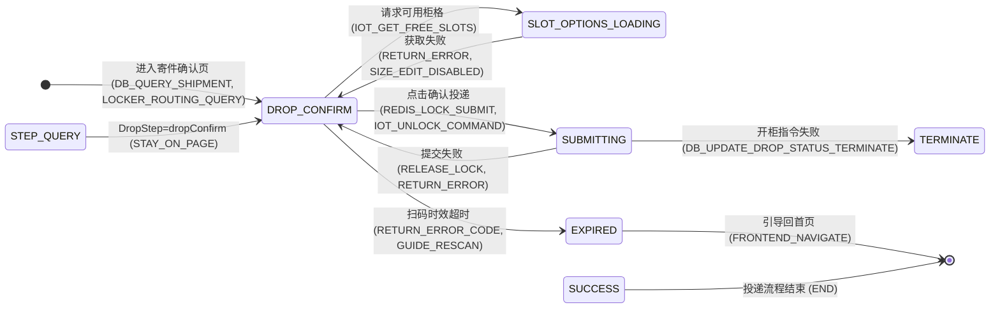

# intent-gate 完全教程：让 AI 编码代理"不懂就问"的闸门

> **读者对象**：想理解 intent-gate 这个项目的人——不管是使用者、维护者，还是想借鉴其设计的学习者。
> **前置知识**：会一点 Python、知道 MCP（Model Context Protocol）是"AI 与工具之间的插座协议"即可，其余概念本文从零讲。
> **怎么读**：第 0–1 章是思想课（为什么存在），第 2–4 章是系统课（怎么运转），第 5–6 章是代码课（源码逐文件），第 7–8 章是实践课（工程哲学 + 动手实验）。想快速上手就跳到第 8 章，遇到不懂的再回来查。

---

## 目录

- [第 0 章 先讲一个事故](#第-0-章-先讲一个事故)
- [第 1 章 核心思想：把意图对齐做成"测量"](#第-1-章-核心思想把意图对齐做成测量)
- [第 2 章 系统全貌：一个 MCP 服务器 + 一个插件 + 一个安装器](#第-2-章-系统全貌)
- [第 3 章 生命周期：一次需求分析的完整旅程](#第-3-章-生命周期一次需求分析的完整旅程)
- [第 4 章 文件契约：.harness 下的户口本](#第-4-章-文件契约harness-下的户口本)
- [第 5 章 源码导游（逐文件）](#第-5-章-源码导游逐文件)
- [第 6 章 lint 规则教科书（L0–L13）](#第-6-章-lint-规则教科书l0l13)
- [第 7 章 工程哲学：从代码里读出的十二条军规](#第-7-章-工程哲学从代码里读出的十二条军规)
- [第 8 章 动手实验](#第-8-章-动手实验)
- [附录 A 术语表](#附录-a-术语表)
- [附录 B 工具速查表](#附录-b-工具速查表)

---

## 第 0 章 先讲一个事故

### 0.1 同一个需求，两种结局

假设你拿到这样一份需求（这个例子来自项目 README，是真实的对照实验）：

> "做一个智能快递柜的寄件确认页：展示运单信息，可以修改柜型，扫码投递。要求防重复、防超时、信息脱敏。"
>
> —— 就这么多。没有流程图，没有异常说明。

**没有 intent-gate 时，AI 编码代理会怎么做？**（对照组实测结果）

- "防重复提交"？→ 前端把提交按钮置灰。看起来合理，但**服务端根本没有防护**——用户用抓包工具连发 10 个请求，就产生 10 个运单。
- "提交成功之后"？→ 硬编码一个成功页。但业务上提交成功后的下一步要由后端返回的 `DropStep` 决定（可能是身份校验、可能是支付通道、可能是查询进度）——硬编码就把这条链路写死了。
- "扫码超时"？→ 完全没建模。超时后运单卡死在"寄件中"，没有 EXPIRED 状态，没有引导重新扫码。
- "重复投递"？→ 没考虑。同一个柜格可能被并发开锁。

**有 intent-gate 时**，同一个需求走完流程后，交付物是一个**技术上逐边注释的 Mermaid 状态机**：



注意那条边：`DROP_CONFIRM --> SUBMITTING: 点击确认投递 (REDIS_LOCK_SUBMIT, IOT_UNLOCK_COMMAND)`。`REDIS_LOCK_SUBMIT` 是**人类拍板**的结果——当时问的问题是"如何防重复提交"，人回答："**服务端 Redisson 锁，等待 10s / 租约 300s**"。这句话被一字不改记进了对齐流水，然后注入到状态机边和决策表 BR-01 里。

两条路的差别不是"图好不好看"，而是：**第二种路里，每一个当初会被"猜"过去的地方，都有一个人拍过板，且拍板记录可追溯。**

### 0.2 问题的本质：模型在猜，没人发现

AI 编码代理的灾难模式高度一致：

1. **happy path 幸存者偏差**——只写成功流程，不写失败流程（"支付失败怎么办？没提，那就不写"）。
2. **把"合理假设"当"业务事实"**——"前端置灰防重复"听起来合理，但那是技术方案，不是业务决策；而且它只防了用户，没防住并发。
3. **含糊需求被"平滑"**——自然语言可以含糊（"看情况跳转"），但代码必须确定。含糊的地方模型会**平滑地补一个最像样的默认值**，而且补得毫无痕迹——没人知道这里有个决定被替他做了。

更糟的是：**模型不知道自己不知道**。你问它"这个需求你理解得对吗？"，它几乎总是说"对"——这不是它骗你，是它的自评与真实正确率几乎没有相关性（事后合理化，不是测量）。

### 0.3 为什么"让模型自评信心"是死路

直觉的解法是问模型"你有几分把握"，但这是死路：

- **口头自信**是事后合理化，与真实正确率相关性极低；
- **token 级 logprobs** 到不了语义层的不确定性——"退款后应该有个中间状态吗？"这种问题根本不会在 token 概率里显形；
- 就算能拿到，API 也不暴露。

所以 intent-gate 换了一条路：**从不问模型"你确定吗"，而是让模型"生产"，然后从产物上读置信度。** 这就是整个项目的认识论地基，下一章展开。

### 0.4 本教程的阅读地图

- 第 1 章：三个核心机制——画图测量、四层探测、三级漏斗。
- 第 2 章：系统的三个身份（MCP 服务器 / 插件 / 安装器）与目录结构。
- 第 3 章：一次需求分析从进场到交付的全流程（这是最重要的一章）。
- 第 4 章：所有状态为什么活在文件里（`.harness/requests/` 文件契约）。
- 第 5 章：源码逐文件讲解。
- 第 6 章：lint 的 L0–L13 每条规则的来龙去脉。
- 第 7 章：工程哲学十二条。
- 第 8 章：动手跑起来。

---

## 第 1 章 核心思想：把意图对齐做成"测量"

### 1.1 语言会撒谎，图不会

一句话概括整个项目：**画图不是交付物，画图是测量仪器。**

为什么？因为自然语言是"可糊弄"的，图不是：

> "退款处理完之后流程就结束了。"

这句话没有任何问题，你甚至挑不出毛病。但把它画成状态机，你必须回答：

- REFUNDING 这个状态有没有出边？
- 出边指向哪？REFUNDED？还是订单关闭？
- 什么触发这条边？支付网关回调？人工操作？

**每一个问题都是一个被迫做出的离散决定。** 含糊的意图在散文里是隐形的，在图上是一个洞。vague 的句子可以蒙混过关，vague 的图不能——图里每个节点每条边都必须有落点。

这就是"**置信度是图的属性，不是模型的属性**"的工程含义：绿灯 🟢 不是说"模型觉得自己懂了"，而是说"状态机的每条边都有依据、九类雷区都扫过、lint 机械检查 CRITICAL 归零、每个 gap 都有人拍过板"。

### 1.2 四层探测：从"自己知道不懂"到"自己不知道不懂"

需求里的歧义分四种，每种需要不同的探测器：

| 层 | 机制 | 能抓住什么 | 谁在探测 |
|---|---|---|---|
| ① 被迫形式化 | 第一回合就硬画草稿图，画不下去的地方标 `TBDn` 占位 | **显性 gap**——模型知道自己不知道 | 模型自己 |
| ② 九类清单扫雷 | 按九类歧义点（异常路径/回滚/条件组合/字段语义/幂等与越权/术语…）逐元素扫 | **半隐性 gap**——模型不会自己卡壳，但按清单扫会暴露 | 模型 + 词表 |
| ③ 机械 lint | L0–L13 规则，由代码执行 | **全隐性 gap**——模型填完了自己都没意识到（如"表没人写入"） | 纯代码 |
| ④ 蓝军独立评审 | 独立会话 + 信息节食（可选 skill） | **作者的系统性盲区**——①②③都是同一双眼睛，④换一双 | 另一个 agent |

关键认知：①和②靠模型自觉，③靠代码强制，④靠换人。**①②③是同一双眼睛，④是换一双眼睛。** 所以红蓝对抗才必须独立会话——同一进程里的"对抗"会退化成自查。

### 1.3 三级对齐漏斗：越往下越贵，所以从便宜的试起

发现一个 gap 之后，按下面的顺序消解，**每一级都比上一级贵**：

```
① 代码实证（零人际成本）
   🔧技术类 gap 先翻旧代码：查哪个 Redis key、调哪个接口、既有锁方案。
   代码有唯一 ground truth → 直接注入，落账 source="code"。

② AI 公示推断（自动，但带否决权）
   代码没有直接答案但能类比（如从 addOrder 推断 deleteOrder 逻辑）：
   登记进"推断待确认清单"，会话末批量请人类点头。
   关键纪律：公示 ≠ 静默。必须带显式依据链、带标注、带确认回执。
   🔴 资金主流程和红线规则禁止纯推断——必须发题让人拍板。

③ 人工拍板（最贵，只留给必须人答的）
   结构化选项题（≥3 个互斥选项 + "其他"），一次一题。
   核心主流程题可把 AI 推荐项放在选项 1，人类从"想答案"降级为"点头/摇头"。
```

**全程非阻塞**是铁律：发题即返回，绝不挂起等人类。答案通过文件落盘，会话恢复时对账回收。这让"AI 干活"和"人类思考"完全解耦——下班前 AI 把问题清单留在文件里，第二天人类答完，AI 继续。

### 1.4 两个贯穿全文的关键词

- **非阻塞**：任何工具调用都不会等待人类。等待是卡死之源（客户端超时配置不当直接炸），文件落盘 + 会话对账是它的工程化。
- **文件即真相**：`钉钉/对话框只是传输通道，文件才是唯一事实源`。通道可以丢消息，文件不丢。进程随会话生死无所谓——现场全在磁盘上。

---

## 第 2 章 系统全貌

### 2.1 三个身份

intent-gate 同时是三个东西：

| 身份 | 是什么 | 干什么 |
|---|---|---|
| **MCP 服务器** | `pip install intent-gate-mcp` 后得到的 `intent-gate` 命令，以 stdio 子进程被任何 MCP 客户端拉起 | 提供 13 个工具 + 1 个 prompt：发题、核销、lint、锚点定位……（强制半边） |
| **插件**（Claude Code / DSH） | 仓库里的 `skills/`、`hooks/`、`.claude-plugin/` | 每个会话开局自动注入纪律文本；skill 按场景触发（纪律半边） |
| **安装器** | `intent-gate install --target cursor/codex/dsh` | 把上面的接线写进各家的配置文件，合并而非覆盖，可卸载 |

**两半的关系**：skill/hook 是"纪律"（建议），MCP 服务器是"执法"（强制）。只有纪律没有执法 = 只有好建议，没有任何机械闸门——所以 SessionStart hook 每次启动都会自检：`intent-gate` 命令不在 PATH 上就大声报警。

### 2.2 进程模型

```
MCP 客户端 (Claude Code / DSH / Cursor / ...)
   │  拉起子进程，stdio 双向 JSON-RPC
   ▼
intent-gate 进程 ──读写──▶ {workspace_root}/.harness/requests/{需求名}/_review/*.md
   │
   └─ 无守护进程、无数据库、无凭据、无外部服务（零配置开箱即用）
```

- 默认 `stdio` 传输：进程随 agent 会话生、随会话死。**无所谓**——状态全在文件里。
- 可选 `--mcp-transport sse --mcp-port 8400` 走网络。
- 日志全走 stderr（MCP stdio 要求 stdout 纯净，这是协议纪律）。
- Windows 下强制 UTF-8 输出（GBK 控制台遇 emoji 会崩，而 skill 文本里全是 📋🔴）。

### 2.3 目录结构导游

```
intent-gate/
├── pyproject.toml            # 打包定义：依赖只有 mcp / pydantic / pydantic-settings / mammoth
├── .mcp.json                 # 插件级 MCP 声明：command: intent-gate
├── README.md                 # 门面文档（写得很好的产品说明书）
├── docs/
│   ├── STRUCTURE.md          # 目录结构逐文件说明
│   ├── DESIGN.md             # 意图对齐子系统设计（三级漏斗、文件契约）
│   ├── ARCHITECTURE.md       # 架构决策（分层、长连接取舍、失败姿态）
│   └── PLUGIN.md             # Claude Code 插件形态
├── hooks/                    # 会话开局纪律注入
│   ├── hooks.json            # SessionStart 挂载声明
│   ├── session-start         # bash 版注入脚本
│   └── run-hook.cmd          # Windows 引导包装
├── skills/                   # 四个 skill（纪律文本，单一事实源）
│   ├── using-intent-gate/    #   每会话自动注入：何时该升级人工
│   ├── requirement-alignment/#   分析需求时触发：对齐工作流纲要
│   ├── contract-coding/      #   编码期附加层：代码必须从契约生成
│   └── red-blue-review/      #   可选：蓝军评审 playbook
├── src/intent_gate/          # ★ Python 包本体
│   ├── __main__.py           #   MCP 入口：装配 + 注册两个工具面
│   ├── config.py             #   Settings（HG_* 环境变量）
│   ├── logging.py            #   日志（stderr）
│   ├── models.py             #   纯 stdlib：token 生成器、Gate 模型
│   ├── security.py           #   纯 stdlib：回复解析、白名单、限流
│   ├── installer.py          #   install/uninstall --target
│   ├── hook.py               #   Python 版 session-start 发射器
│   ├── alignment/            # ★ 意图对齐子系统
│   │   ├── store.py          #     ReviewStore：_review/ 全部文件读写（契约核心）
│   │   ├── manager.py        #     AlignmentManager：业务逻辑 + 两个契约函数
│   │   └── tools.py          #     MCP 工具注册（9 个）
│   └── analysis/             # ★ 需求分析子系统
│       ├── playbook.md       #     需求分析 playbook（法律文本）
│       ├── engine.py         #     fresh/resume 双路径 + 机械初筛 + record_analysis
│       ├── lint.py           #     机械检查器 L0-L13（逻辑冻结）
│       ├── mapper.py         #     映射表锚点脚本定位（逻辑冻结）
│       ├── tools.py          #     MCP 工具注册（4 工具 + 1 prompt）
│       └── docx.py           #     .docx 提取（markitdown → mammoth 两级）
└── tests/                    # 69+ 条测试，纯文件驱动，零凭据
```

### 2.4 两个子系统一张图

```
                    ┌─────────────────────────────────────┐
                    │          intent-gate 进程            │
                    │                                     │
  分析需求  ──────▶ │  analysis 子系统（需求解析）          │
  "解析这个PRD"     │  analyze_requirement(fresh/resume)   │
                    │  record_judgment   ← 宿主语义落账     │
                    │  lint_summary      ← 机械门禁         │
                    │  draft_mapping     ← 锚点脚本定位      │
                    │  playbook.md       ← 法律文本(prompt) │
                    │                                     │
  对齐意图  ──────▶ │  alignment 子系统（意图对齐）          │
  "这个gap怎么定"   │  dispatch_question → 落盘 → 返回宿主   │
                    │  collect_answers / resolve_question  │
                    │  record_inference / confirm_inferences│
                    │  rebroadcast / list_pending / abandon│
                    └──────────────┬──────────────────────┘
                                   │ 文件契约（唯一事实源）
                                   ▼
              .harness/requests/{需求名}/_review/*.md
```

---

## 第 3 章 生命周期：一次需求分析的完整旅程

> 本章是核心。跟着一个需求走完全程，你会理解所有工具为什么存在。
> 状态词表先记住：`blocked`=🔴未消除；`draft`=对齐中；`pending_review`=产物待审；`approved`=获准开工（只能由人类或蓝军 PASS 授予，**MCP 永不自授**）。

### 3.0 全程路线图

```
进场 analyze_requirement（fresh 机械初筛 / resume 续跑）
  → record_judgment（宿主正式判断落账）
  → 第一回合就硬画草稿图（卡壳处 TBDn 占位）
  → 逐 gap 分流：代码实证 / record_inference / dispatch_question
  → 人类回答 → collect_answers → 注入图 → resolve_question 核销
  → 循环至 intent_aligned_ready=true
  → draft_mapping（锚点脚本定位）→ 写 summary.md + sql/*.sql
  → lint_summary（CRITICAL=0 才可交付）→ 交付
  → （可选）蓝军评审 → approved → contract-coding 开工
```

### 3.1 开场：analyze_requirement（fresh 路径的机械初筛）

宿主 agent 调 `analyze_requirement(feature="智能快递柜", prd_path="...")`。如果 `.harness/requests/智能快递柜/_review/` 下没有现场，走 **fresh**：读 PRD → 机械判定 → 落盘 `analysis-draft.md`。

引擎是纯 Python 的**信号词计数**（`engine.py`），不是 LLM：

- **型态判定**：数三种信号，超过门槛就触发对应型态
  - 状态信号（"待审核/已支付/退款中"等中文状态词 + 大写枚举如 `WITHDRAW_CONFIRM`）≥ 4 → State-Driven → 要画状态机
  - 跨系统信号（"第三方/回调/Redis/MQ/接口"）≥ 3 → Process-Driven → 要画时序图
  - 规则信号（"如果/否则/必须/白名单"）≥ 3 → Rule-Driven → 要生成决策表
- **复杂度**：2 种以上型态或任一达门槛 = complex；单一型态未达门槛 = medium；纯 CRUD = simple。低强度多型态会降级为 medium（防过度设计）。
- **歧义点初筛**：一组正则可判的雷（如"只提防重、没提服务端锁"→ 🔴；"看情况跳转"→ 🔴；"按最高展示"无口径 → 🟡），外加一条硬规则：**全文没有任何失败词（失败/异常/超时/回滚）却提到"成功/提交/支付"→ 🔴 "只有成功没有失败流"**。
- **置信度灯**：有 🔴 即 🔴；有 🟡 即 🟡；否则 🟢。

> ⚠️ **初筛只是绊线，不是判决**。引擎 docstring 写得很清楚："初筛 = 交叉校验信号；正式判断由你按 playbook 语义分析后调 record_judgment 落账"。机械规则会误报漏报，人类（宿主 agent 的语义分析）才是正式裁判。

### 3.2 落账：record_judgment

宿主 agent 通读 PRD + 初筛信号，做出正式判断，调 `record_judgment` 落账。MCP 负责**校验**（型态枚举、复杂度枚举、每题的 severity/category/选项数）和**落盘**（覆盖式重写 `analysis-draft.md`，frontmatter 标记 `generated_by: host agent`）。

校验不过直接拒收——比如 gap 少于 3 个选项且无推荐项，会报错。为什么？"落账时不拦，开闸时才被拒 = 账面上挂了一道永远发不出去的题"（源码注释原文）。

### 3.3 发题：dispatch_question（先落盘，后发送）

对每个 gap，调 `dispatch_question(feature, gap, category="📋"/"🔧", severity="🔴"/"🟡", options=[至少3个])`：

1. **校验**（`manager.register_question`）：category/severity 必须是词表内的；无推荐项时选项必须 ≥3。
2. **生成 token**：`HG-7F3A` 这种短人类可读令牌（4 位十六进制，与既有令牌不撞）。
3. **先落盘**：把题目作为一行 append 到 `pending-questions.md`（checklist 格式，见第 4 章）。
4. **返回给宿主**：`{"ok": true, "token": "HG-XXXX", ...}`——注意是"返回给宿主"，single 通道不发群，由宿主按精准提问格式向用户提问。

**为什么"先落盘后发送"是铁律？** 防进程猝死丢 token：如果先发消息后写文件，发到一半进程死了，用户答了题但系统不知道这道题存在，答案就丢了。先落盘，发送失败也无所谓——题已在清单里，rebroadcast 补发即可。

发题后**本轮对话可以结束**——非阻塞。这是设计里最反直觉也最重要的一点。

### 3.4 回答：精准提问格式

宿主向用户提问的格式是硬规定的（playbook Step 0.5）：

```
🟡 意图对齐：状态图中"退款"转移的目标状态未定义（§3.5 状态图）

  1. 进入 REFUNDING，支付网关回调成功后变为 REFUNDED
  2. 直接变为 REFUNDED，支付退款异步处理
  3. 订单状态不变，创建独立退款单跟踪
  4. 其他（请输入）

请选择 [1/2/3/4]：
```

规则：一次只问一个 gap；选项互斥且具体（必须包含状态值/动作/结果，"正常处理"这种模糊描述是禁语）；必须带"其他"；按影响范围排序，主流程的先问。

用户答"1"，或者选"4"再输入原文——**原文一字不改**地进入 alignment-log。

### 3.5 核销：resolve_question 与它身后的三道门禁

拿到答案后宿主调 `resolve_question(feature, token, answer, responder, interpretation, landing, source)`。这个工具背后有三道机械门禁（这是"执法"的精华）：

1. **绘图层草稿门禁**：核销前 `analysis-draft.md` 必须已存在且含 ```` ```mermaid ```` 块（或显式声明"无需画图"）。**不许带着没动过笔的状态进入核销**——画图是探测仪器，你都没画过图就说"懂了"，拒收。
2. **token 门禁**：token 必须还在待决清单里（已核销/已废弃的拒收）。
3. **落点门禁**：`interpretation`（注入语义）和 `landing`（精确落点）都非空。落点必须精确到"状态机边/时序图步骤/决策表规则号/字段"——**找不到落点就禁止核销，当场回问**。空落点 = 静默丢弃意图，机械拒绝。

通过后做两件事：
- **checklist 打勾**：`- [ ]` → `- [x]`，追加核销摘要和回填时间；
- **写 alignment-log**：追加一条标准流水 `## Q{n}`，四个字段（提问 / 人类原话 / 注入解读 / 落点）——这是蓝军 R1"注入保真"复核的唯一依据，**改格式 = 毁约**（源码注释原文）。

`source` 参数决定"人类原话"的形态：
- `code` → `来源: 代码实证（{类/方法}）`（零人际成本的技术答案）
- `dialog` → `{答案}（{回答人}，对话框）`
- `group` → `{答案}（{回答人}，钉钉群）`（姊妹篇通道，本仓默认不用）

### 3.6 草稿图与 TBDn 占位符（绘图层探测）

这是整个流程里最"反直觉"的纪律：**第一回合，不等任何答案，先对着 PRD 硬画草稿图**。画不下去的地方用占位符：

```
state "???待确认" as TBD1      ← 节点占位
SUBMITTING --> TBD2 : 提交后   ← 边占位
```

每个占位符就是一个断层，记入 `analysis-draft.md`（标注 ✏️绘图层）。然后分流：🔧技术 → 翻代码实证；📋业务 → 发题问人。

两个细节（都是踩过坑的教训）：

- **禁止裸写 `--> ???`**。lint 的状态标识符正则字符集不含 `?`，裸 `???` 的边会被解析器**静默吃掉**——本来该报"图有问题"，结果整条边消失，L1/L2 全部失明。标准占位 `TBDn` 能命中字符集，不会被吃。
- **占位只允许两种方式消除：代码实证或人类拍板。禁止用猜测填掉**。交付的 summary 图里残留 ???/TBDn = lint L13 CRITICAL，不许交付。

### 3.7 中断与续跑（resume：只认文件，不认记忆）

分析中断了、会话关了、换了个 agent——怎么办？`analyze_requirement` 检测到现场文件存在，自动走 **resume** 路径：

- 只读文件现场，汇报：已答几题、还挂几题、几条推断未确认、inbox 有没有新答案、draft 在不在；
- 给出**下一步动作建议**（`next_actions` 按优先级排好："collect_answers → 有 N 条新答案待领取注入"、"rebroadcast_pending → 还有 N 题未决"……）；
- 宿主照单执行即可，**不依赖任何 session 记忆**。

配套的对账工具 `rebroadcast_pending`：每次开工/用户说"继续"时调用，返回未勾题清单，宿主逐题向用户确认。注意：**闸门不设超时**——没人答说明不急，是用户的选择（砍掉 NO_REPLY 兜底路径，这是有意的设计决定，见 DESIGN.md §4.3）。

### 3.8 生成产物：draft_mapping → summary.md

所有题核销完（`list_pending_questions` 返回 `intent_aligned_ready=true`），进入产物生成。产物是单文件 `summary.md`，包含：frontmatter（status/intent_aligned 词表）、需求概述、**意图注入映射表**、模块影响、数据模型（DDL 落 `sql/*.sql`，禁止内嵌报告）、状态机、时序图、决策表、缓存场景、红线检查、任务拆分。

其中**意图注入映射表**是关键回执：每条人类注入的意图一行，落点精确到边/步骤/规则号。而落点锚点**禁止手写**——先调 `draft_mapping`，脚本从 alignment-log 读每条注入的落点描述，在 summary.md 里**真实定位**（章节号、BR 定义行、mermaid 边），生成 `_review/mapping-draft.md`，宿主只补审语义列。**未定位的条目必须当场回问人类，禁止静默放过。**

为什么？手写章节号是错位事故的头号来源——"我记得是 §6"其实是 §5.3。脚本定位在生成侧绝育这类事故。

### 3.9 交付门禁：lint_summary CRITICAL=0

交付前必须调 `lint_summary(summary_path)`，机械自检 L0–L13（第 6 章详解），**CRITICAL 归零才可交付**。检查报告落盘 `_review/lint-report.md`，自带三张矩阵骨架（转移清单 / 表读写矩阵 / 引用核对清单）——矩阵是给蓝军填判断列的，**禁止手建**。

这是"被代码检查，而不是被模型自报"的关键一关：CRITICAL > 0 时 `deliverable=false`，报告拒绝"认为自己合格"。

### 3.10 可选：红蓝对抗（独立会话！）

complex 需求交付后，用户可选蓝军评审（skill `red-blue-review`）。铁律：

- **蓝军必须另开独立会话**（信息节食：只读产物 + 过程文件 + rubric，禁止索要红军的思维链）——同 session 的"对抗"是自查；
- 检查项 R1–R9（注入保真 / 降级合规 / 歧义漏判 / 报告规范 / 数据模型 / 术语对齐 / 红线 / 状态一致性 / **跨图一致性**）；
- 结论三态：PASS / FAIL-可整改 / FAIL-重做；最多 2 轮，仍 FAIL 则 ESCALATE 人类裁决；
- `approved` 只有两条合法来源：**蓝军 PASS 或人类直接拍板**——红军永远不自授。

### 3.11 编码期：contract-coding（附加层）

编码开工时，skill `contract-coding` 只立一条规矩：**代码从 mermaid 契约生成，绝不违背契约**。开工门禁（机械项，无商量）：

1. frontmatter `status: approved` 才动工；`pending_review` / `blocked` → 停下报回人类（**不是**"再分析一遍"——契约状态是人类拍板的事）；
2. `_review/lint-report.md` 的 CRITICAL > 0 → 契约自身带机械错误，先修契约再写代码。

编码中发现契约错了/不够用？**漂移 = 停线**：停下 → 升级问人 → 先改契约（重新对齐 + 重跑 lint）→ 再改代码。

---

## 第 4 章 文件契约：.harness 下的户口本

### 4.1 为什么是文件

没有数据库、没有内存态、没有常驻进程——全部状态是 `{workspace_root}/.harness/requests/{需求名}/_review/` 下的一堆 Markdown 文件。理由：

- **进程随会话生死**：MCP stdio 子进程死就死了，文件不丢；
- **跨 session 天然成立**：任何 agent、任何时间点打开文件就是全部现场；
- **人类可读可审**：checklist 本身就是给人类看的对账单；
- **git 可追踪**：README 提醒"账本被 git 跟踪，不想提交就加 .gitignore"。

### 4.2 文件清单

| 文件 | 谁写 | 用途 |
|---|---|---|
| `pending-questions.md` | `register_question`（两仓共用） | 待决问题 checklist（`- [ ]` 未勾 / `- [x]` 核销 / `- [~]` 废弃）。**勾不打完禁止标 intent_aligned** |
| `alignment-log.md` | `resolve_question` / `confirm_inferences` | 意图对齐流水：`## Q{n}` + 提问/人类原话/注入解读/落点 四字段。蓝军 R1 复核的唯一依据 |
| `inference-pending.md` | `record_inference` | AI 推断待确认清单（`INF-{n}` 编号**永不复用**） |
| `analysis-draft.md` | 引擎 fresh / `record_judgment` | 解析草稿快照（frontmatter + 信号 + gap 清单），resume 续跑的依据 |
| `inbox/` | `file_inbound_reply`（姊妹篇调用） | 群回复落盘区，答案原话一字不改 |
| `inbox/_consumed/` | `collect_answers` | 已领取答案归档（防重复下发） |
| `lint-report.md` | `lint_summary` | 机械检查报告 + 三张矩阵骨架 |
| `mapping-draft.md` | `draft_mapping` | 映射表锚点脚本定位草稿 |
| `review-request.md` / `review-findings.md` / `revision-log.md` | 红军/蓝军（宿主） | 红蓝评审三件套（可选） |

### 4.3 checklist 行格式逐字段拆解

`pending-questions.md` 的一行（来自 DESIGN.md 的真实格式）：

```
- [ ] [HG-7F3A] 📋 退款后订单状态？| 选项: 1.REFUNDING→REFUNDED 2.直接REFUNDED 3.独立退款单 4.其他 | @张三 | 发出: 2026-08-08 21:00
```

逐段拆解：

| 段 | 含义 | 说明 |
|---|---|---|
| `- [ ]` | 未勾 | `[x]` 核销、`[~]` 废弃。**行首是机器对账的锚** |
| `[HG-7F3A]` | 关联令牌 | 人类回答时带它，系统凭它认领答案 |
| `📋` / `🔧` | 类别 | 业务题 / 技术题，决定该 @ 谁 |
| `🔴` / `🟡` | 严重级 | 🔴 未消 → status 必须 blocked（行首解析） |
| `gap` | 断层描述 | 正文里 `\|` 一律替换为 `/`——它是字段分隔符，不能出现在内容里 |
| `选项: ...` | 候选 | 固定尾巴 `4.其他` |
| `@张三` | 期望回答人 | 展示用 |
| `发出: ...` | 时间戳 | 核销时追加 `核销: ...` 和 `回填: ...` |

机器对账的几个细节（都是从事故里长出来的）：

- **token 精确匹配**：`pending_tokens()` 只认 `[HG-` 前缀 + 4 位十六进制，防止子串误配；
- **推断编号精确匹配**：`INF-12` 用行首正则 `^- \[.\] (INF-\d+)` 匹配，**禁止子串匹配**——否则正文里提到 "INF-1" 会结算错行（有专门测试）；
- **原子写**：所有修改先写同目录临时文件再 `os.replace`（同文件系统内原子）——进程猝死不留半个文件（审计修复项）；
- **feature 名防逃逸**：`ReviewStore` 构造时拒绝含 `/`、`\`、`.`、`..` 的需求名——否则 `feature="../../etc"` 就能把账本写到任何地方（路径逃逸攻击，有专门测试）。

### 4.4 alignment-log 的四字段契约

```markdown
## Q3 退款后订单状态？（2026-08-08 22:10）
- 提问：退款后订单状态？（选项: 1.REFUNDING→REFUNDED 2.直接REFUNDED 3.独立退款单 4.其他）
- 人类原话：1（张三，对话框）
- 注入解读：支付回调成功后进入 REFUNDING，回调完成变为 REFUNDED
- 落点：§3.5 状态机新增两条边（REFUNDING → REFUNDED）
```

"人类原话"的三种合法形态（DESIGN.md §4.2 硬约束）：

- 群/对话框成员**一字不改**的回复 + 身份；
- `来源: 代码实证（{类/方法}）`；
- `[AI推断·依据: {推断链}]（确认人: {谁}，{时间}）`。

**追责效力**在这里：谁拍的板、拍的是什么、注入到哪，全部可查。

### 4.5 inbox 的防伪造细节

群回复落盘时，sender/nick 写入 front-matter 前要消毒（`_meta`）：**换行压成空格**——nick 里塞换行可以伪造 meta 行（比如伪造 sender 行冒充白名单成员）。答案正文不消毒（原话一字不改），但 token/answer 的解析由 `security.py` 完成（第 5 章）。

---

## 第 5 章 源码导游（逐文件）

> 建议对照源码读这一章。每个文件我只讲"它解决什么问题 + 关键机制"，不逐行复述。

### 5.1 入口层：`__main__.py` / `config.py` / `logging.py`

**`__main__.py`（125 行）** —— 全部装配都在这：

```python
alignment = AlignmentManager(workspace_root=settings.workspace_root)
mcp = FastMCP("intent-gate", instructions=_INSTRUCTIONS)
register_alignment_tools(mcp, alignment)      # 9 个意图对齐工具
register_analysis_tools(mcp, settings.workspace_root)  # 4 工具 + 1 prompt
```

- CLI 三个子命令：`hook session-start`（发射纪律文本）、`install/uninstall --target`（接线）、默认跑 MCP（stdio/sse）。
- `_INSTRUCTIONS` 是给宿主 LLM 的常驻指令：分析前先读 playbook、歧义走漏斗、落点必须精确、交付 lint 归零。
- `_force_utf8_stdio()`：Windows GBK 控制台兼容（emoji 输出会崩）。

**`config.py`（36 行）** —— pydantic-settings，`HG_` 前缀，只有 3 个配置项：`channel`（只允许 `single`）、`workspace_root`、`log_level`。亮点是 fail-fast：`HG_CHANNEL=group` 直接抛 ValueError 并指引迁移到姊妹篇——**静默降级 = 题永远到不了群，用户还以为发出去了**（源码注释原文）。

**`logging.py`（23 行）** —— 纯 stdlib。注意 `uvicorn.access` 压到 WARNING（SSE 模式的访问日志噪音）。

### 5.2 纯 stdlib 核心：`models.py` / `security.py`

这两个文件**零第三方依赖**，刻意保持可独立单测（设计意图：核心逻辑不依赖项目依赖装没装）。

**`models.py`（66 行）** —— `new_gate_token()`：`HG-` + 4 位大写十六进制（`HG-7F3A`），碰撞则重试。还有 `Gate`/`GateEvent`/`GateStatus` 数据类——注意它们目前是"预留"（姊妹篇的阻塞闸门用），本仓的意图对齐走文件契约，不依赖内存态。

**`security.py`（63 行）** —— 三件小事，都做得很严谨：

- `parse_reply(text)`：从回复里提取 `[HG-XXXX]` 令牌和清理后的答案正文。正则大小写不敏感，还顺带剥掉钉钉机器人消息开头的 `@机器人`。
- `SenderPolicy`：白名单，**空白名单 = 拒绝所有人**（fail-closed）。
- `RateLimiter`：滑窗限流（默认 30 次/分钟/发送者），防回调洪水/重放。

### 5.3 alignment 三件套：`store.py` / `manager.py` / `tools.py`

**`store.py`（417 行）** —— **整个系统的契约核心**。`ReviewStore` 封装 `_review/` 目录的所有读写。方法按职责分四组：

- pending 清单：`add_pending`（发题登记，先落盘）/ `check_off`（核销打勾）/ `abandon_pending`（废弃）/ `unchecked_lines` / `pending_red_lines`（未决 🔴 题，status=blocked 的依据）/ `question_summary`（取 gap 段）；
- alignment-log：`append_alignment_log`（追加 `## Q{n}` 四字段流水）；
- inbox：`write_inbox`（群回复落盘，front-matter 消毒）/ `read_unconsumed` / `mark_consumed`（归档防重复领取）；
- 推断：`add_inference`（登记 INF-n）/ `settle_inference`（确认/驳回）/ `abandon_inference` / `inference_summary`。

两个实现细节值得记：**原子写**（临时文件 + `os.replace`）和 **feature 路径逃逸防护**（构造时校验）。

**`manager.py`（409 行）** —— 业务层。两个**契约函数**是本模块的对外接口，姊妹篇 intent-gate-service 也复用它们（"绝不另起契约实现"）：

- `register_question(store, gap, ...)`：校验（category/severity/选项数）+ 落盘，返回 `{ok, token, question}`。**dispatch 与 group_dispatch 共用它，格式两边不分叉**；
- `file_inbound_reply(workspace_root, policy, raw_text, sender, nick)`：验白名单 → 解析 token → 按 token 反查需求目录 → 答案落盘 inbox/。**只递送原话，不做注入语义**——注入是宿主的活。

`AlignmentManager` 的方法与 MCP 工具一一对应（dispatch/collect/resolve/record_inference/confirm_inferences/rebroadcast/list_pending/abandon×2），其中 `resolve_question` 和 `confirm_inferences` 都过**绘图层草稿门禁**（`_require_drawing_draft`：draft 存在且含 mermaid 块或显式无图声明，否则拒收）。

`list_pending` 的**就绪口径**（多个工具必须一致，是测试覆盖点）：`pending 题 = 0 且 未确认推断 = 0 且 inbox 新答案 = 0` 才 `intent_aligned_ready=true`——**inbox 里躺着没领取的答案，意图不算齐**（答案还没注入图/规则）。

**`tools.py`（126 行）** —— 纯注册层。9 个 `@mcp.tool()`，docstring 即工具说明（MCP 客户端把这些 docstring 暴露给 LLM，所以写得像说明书）。全程非阻塞：`dispatch_question` 是 `async` 但内部不 await 任何人类。

### 5.4 analysis 六件套

**`playbook.md`（400 行）** —— 法律文本。经 MCP prompt `doc_analysis_playbook` 全文分发（DSH 侧因 mcp-client 不桥接 prompt，由安装器转成 skill 分发）。内容：任务模式判定（fresh/resume）、Step 0 置信度灯、Step 0.5 意图对齐（九类歧义点、精准提问格式、回合制循环、TBDn 纪律、降级回执）、Step 1 型态判定、Step 2 数据模型、Step 3 章节规范（mermaid 写法！）、Step 4 交付门禁 + 约束汇总 16 条。**skill 里不许复制 playbook 正文**——两边不同步是失真事故的头号来源。

**`engine.py`（577 行）** —— 纯 stdlib。两个主入口：

- `analyze_request`（fresh/resume 自动分流）：`_judge_pattern`（信号计数 + 门槛 + 降级修正）、`_scan_gaps`（六条正则 gap 规则 + "只有成功没有失败流"硬规则）、`_confidence`（灯）；fresh 落盘 draft、resume 读文件现场给 next_actions。
- `record_analysis`（宿主判断落账）：校验枚举 + 逐 gap 校验 + 覆盖式落盘 draft。

细节：红灯门禁里 `blocker_task` 必须指向**第一道 🔴 题**而不是第一个 gap（gaps[0] 可能是 🟡，指错了 BLOCKER 就白挂——有专门测试）；相对 PRD 路径按 workspace_root 解析（与账本同基准，防 cwd 错位）。

**`tools.py`（100 行）** —— 注册 4 工具 + 1 prompt。注意模块 docstring 的分层声明："判断：宿主 LLM + playbook；落账：record_analysis；绊线：analyze_requirement；机械：lint_summary / draft_mapping"——**四层职责各归其位，是反复失真修复后的最终形态**。

**`docx.py`（117 行）** —— .docx 提取，两级引擎**无静默降级**：Tier 1 `markitdown`（环境已有则复用增强，表格/合并单元格更好）→ Tier 2 `mammoth`（硬依赖，安装自动带上）。两者皆无 → 拒绝 + 修复指令（"宁可拒绝，不产出低质量文本"）。`.doc` 老格式不支持，如实报错给指引。细节：`_read_bytes` 用 `BytesIO` 而不是路径——Windows 下按路径传引擎会残留句柄导致临时文件无法清理。

**`lint.py`（403 行）** —— 逻辑冻结的机械检查器（第 6 章详述）。判定词表全部是模块级常量，报告头部"机械判定契约"从常量插值生成（防漂移测试 `ContractDisclosureTests` 保证报告与规则不脱节）。

**`mapper.py`（142 行）** —— 逻辑冻结的锚点定位器：`parse_log` 从 alignment-log 提取每条注入的"落点"描述，`parse_summary` 解析 summary 的章节/BR 定义/mermaid 边，`locate` 把落点描述匹配到真实锚点（BR-xx → 定义章节、§x.y → 章节标题、标识符/中文片段 → mermaid 边）。匹配不到 → 标 `⚠️ 未定位`，宿主必须回问人类。

### 5.5 installer 与 hook

**`installer.py`（351 行）** —— `install/uninstall --target cursor/codex/dsh`。铁律：**合并而非覆盖**（用户已有的第三方条目一条不动）、**幂等**（重复 install 无重复条目）、**uninstall 只拆自己接的线**（按识别标记 `_IDENTITY = "intent-gate hook session-start"` 摘除）。三个 target 三种格式：

- cursor：`~/.cursor/hooks.json`（JSON，sessionStart 数组）；
- codex：`~/.codex/config.toml`（TOML 块，Codex hooks 契约官方对齐 Claude）；
- dsh：`$DSH_HOME/profiles/*/cordis.patch.yml`（插入 mcp-client 实例 + skill-filesystem 配置）+ 5 个 skill 复制到 `$DSH_HOME/skills/`。细节：空模板（注释 + `[]`）整体替换（flow 序列与块序列不能共存于同一 YAML document）；BOM 兜底；手动添加的旧配置（`serverName: intent-gate`）也算已装。

**`hook.py`（73 行）** —— Python 版 session-start 发射器。为什么需要它？bash 版依赖 `${CLAUDE_PLUGIN_ROOT}` 插件环境变量，而 uv/pipx 装完 server 走 `install --target` 接线的 agent 没有插件目录——hook 命令必须纯 Python 零依赖。`build_session_context()` 把 using-intent-gate skill 全文 + MCP 缺失警告（`shutil.which("intent-gate")` 找不到就大声报警）拼成注入文本；`emit_session_start` 按目标 agent 输出三种 JSON 契约（cursor snake_case / claude 嵌套 camelCase / standard 顶层）。skill 文本从 wheel 的 `_assets` 读（hatch force-include 打包），源码树回退读仓库真身——**单一事实源，禁止手抄第二份**。

`hooks/session-start`（bash 版）与 `hooks/run-hook.cmd`（Windows 引导 Git Bash）是 Claude Code 插件形态的对应物，逻辑同构。

---

## 第 6 章 lint 规则教科书（L0–L13）

> lint 是"全隐性 gap"探测器：模型填完了自己都没意识到的地方，由代码抓。**逻辑冻结**——这个文件禁止"重写优化"，任何改动都要完整回归评估，因为它是产物格式契约的机械半边。
> 分级宪法（playbook 约束 15）：图论级（机械可判定、零误伤）→ CRITICAL 硬门禁；领域级（需语义判断）→ MINOR 不拦路但强制认领；**有误伤可能的规则永不升 CRITICAL**。

### 分级总表

| 规则 | 检查什么 | 级别 | 一句话理解 |
|---|---|---|---|
| L0 | 有 stateDiagram 块但边解析为零 | 🔴 CRITICAL | 守门员失明兜底：L1-L3 全没法跑，不许假装全绿 |
| L1 | 无成功终态 | 🔴 CRITICAL | 状态机必须有终点（词表见下） |
| L2 | 死状态（无出边） | 🟠 MAJOR | 到了就出不去的状态 = 需求漏了 |
| L2b | 仅有自环、无对外出边 | 🟠 MAJOR | 自环让 L2 失明、无实出边让 L3 失明——夹缝补网 |
| L3 | 同状态多出边 | 🟡 MINOR | 不拦路，但请人确认触发条件可区分 |
| L4 | 映射表锚点（章节号存在 + 关键词匹配标题） | 🔴 CRITICAL | 手写锚点错位是头号事故 |
| L5 | BR-xx 引用无定义 | 🟠 MAJOR | 引用了不存在的规则号 |
| L6 | 表读写矩阵：表无写入 CRITICAL / 无读取 MINOR | 🔴/🟡 | 建了表没人写 = 分析漏了写路径 |
| L7 | alignment-log 的 Q 在映射表无对应行 | 🟠 MAJOR | 注入可能没登记落点 |
| L8 | `[🟡待澄清]` 降级项无人类确认记录 | 🟡 MINOR | 自行降级 = 对齐未完成 |
| L9 | DDL 内嵌 summary / 登记 sql/ 却无文件 | 🔴 CRITICAL | 路径隔离：SQL 只落项目根 sql/ |
| L10 | 有「数据模型」章节但矩阵②为空 | 🔴 CRITICAL | 存在性强制（有豁免通道） |
| L11 | complex 状态下状态机边缺 (技术动作) | 🔴 CRITICAL | 自称 complex 就要每条边可执行 |
| L12 | 映射表落点全是散文（无可机检锚点） | 🟠 MAJOR | 散文锚点 L4 无从校验 |
| L13 | 图内残留 ???/TBDn 占位符 | 🔴 CRITICAL | 占位只许代码实证/人类拍板消除 |
| L13b | 草稿图有占位但待决清单无在飞题 | 🟡 MINOR | 疑似猜测填空或漏发题（单方向防漏） |

### 逐条讲透

**L0 守门员失明兜底**。前面说过 `?` 不在状态标识符字符集内——如果有状态机块却一条边都没解析出来，L1/L2/L3 会全部静默跳过，报告却显示"通过"。L0 专门抓这个：有块无边 = CRITICAL，必须人工核对。

**L1 成功终态**。状态名必须命中词表：`FINISH|SUCCESS|DONE|COMPLETE|成功|已完成|已结束|已完结|已通过`。注意**裸「完成」「结束」刻意不收**——"未完成"含"完成"子串会假通过，所以只收完整终态词。复合终态用 mermaid 描述语法：`已完结 : 放款成功`，**禁止把带括号的复合名直接写进边**（括号不在字符集内，边会被静默吃掉 → 触发 L2/L0 误报）。

**L2 / L2b 死状态**。L2：状态无出边且未流向 `[*]`。L2b 抓的是夹缝：只有自环 `A-->A` 的状态，outs={A} 让 L2 失明，real=∅ 让 L3 失明——永驻态/死循环从两条规则的夹缝漏网（错题集 2026-08-11 收录，有专门测试）。自环 + 有对外出边则正常放行。

**L3 多出边**。同一状态 N 条出边合法（"按事件走的分支"），但触发条件必须可区分——lint 只能标 MINOR 请人工确认（区分度是语义问题，机械判不了，所以永不升 CRITICAL）。

**L4 锚点校验**。映射表里每个 `§x.y` 必须：(a) 章节存在；(b) 关键词命中时标题匹配（如引用写"§3.5 状态机"，标题必须含"状态"/"状态机"）。多锚点连写（`§3.2/§5.1`）各自独立校验，关键词捕获组必须排除 `/`、`§`、括号、顿号——否则连写会被吞并漏检（错题集 2026-08-12）。

**L5 BR 引用**。决策表定义行 = strip 后以 `| BR` 开头；正文引用 `BR-xx` 必须找得到定义行。

**L6 表读写矩阵**。从 `sql/*.sql` 里用 `CREATE TABLE` 正则抓表，然后在 summary 全文里找每张表的写入动作（INSERT/UPDATE/DELETE/save/写入/落库…）和读取动作（SELECT/查询/find…）。双侧小写比较（大小写混写不漏判）。**表无写入 = CRITICAL**（分析漏了写路径），无读取 = MINOR。SQL 目录定位：summary 上溯四级找项目根 `sql/`，不存在则退化到 summary 同级。

**L7 映射行覆盖**。alignment-log 的每个 `## Q{n}` 必须在意图注入映射表里有对应行（首列接受裸数字或 `Q` 前缀）。Q 无映射行 = 注入可能没登记落点。

**L8 降级回执**。正文出现 `[🟡待澄清]` 时，其附近 3000 字符内必须有"确认"/"同意降级"字样。未经人类确认的自行降级 = 意图对齐未完成。

**L9 路径隔离**。两个 CRITICAL：(a) summary 内嵌 `CREATE TABLE`（建表语句形态才算，散文提及不算）；(b) 登记了 `sql/` 相对路径但目录里没有 .sql 文件。背景：SQL 全写进 summary 时 L6 的输入源为空而静默失明——内嵌与"登记了却没产出"都要抓。`\bsql/` 的 `\b` 锚定防 `sqlite/`、`mysql/` 误报。

**L10 空矩阵②兜底**。声明了「数据模型」章节但表读写矩阵为空 = CRITICAL（存在性强制，与 L9 一致性检查互补）。**豁免通道**：显式声明"无新增表/复用旧表"等（正则词表）→ 降 MINOR 留蓝军复核真伪。"门禁逼的是表态，不是逼建表"（源码注释原文）——偷偷不写才 CRITICAL。

**L11 complex 技术打标强校验**。frontmatter 自称 `complexity: complex` 时，状态机每条边的 label 必须含 `(技术动作)`——裸边 CRITICAL。simple/medium 不启用（不误伤）。

**L12 锚点可机检**。映射表数据行若无一行含 `§` 或 `BR-` 锚点 = MAJOR。"决策表 R1 / 时序图 4.3 步骤 2"这类散文锚点让 L4 无从校验，落点必须可机检（draft_mapping 脚本定位可免手写）。

**L13 占位符残留**。mermaid 块内出现 `???` 或 `TBD\d+` = CRITICAL。**先于边解析执行**——占位符可能让边解析静默失明，必须先报。只扫 mermaid 块：散文中引用 PRD 原文（如"§8 TBD"）不算占位，不可误伤。

**L13b 草稿占位无在飞题**。`analysis-draft.md` 的图里仍有占位符，但 `pending-questions.md` 没有任何未勾题 = MINOR（疑似猜测填空或漏发题）。单方向：草稿无占位但有在飞题是合法的（阅读层断层先来）。

### 一份 lint 报告长什么样

`run_lint` 落盘 `_review/lint-report.md`：

```
# summary_lint 机械检查报告（v2）
> 对象：summary.md | CRITICAL 0 / 共 2 条
...
## Findings
- **[MINOR][L3]** 状态 STEP_QUERY 有 5 条出边（→...），需人工确认触发条件可区分
- **[MINOR][L3]** 状态 SUBMITTING 有 3 条出边，需人工确认触发条件可区分

## 矩阵① 状态机转移清单
| 转移 | 触发事件 | 技术动作 | 时序图对应步骤（复核填） | 决策表规则（复核填） | 问题（复核填） |
| `DROP_CONFIRM → SUBMITTING` | 点击确认投递 | REDIS_LOCK_SUBMIT, IOT_UNLOCK_COMMAND | 待核 | 待核 | — |
...
## 矩阵② 表读写矩阵
## 矩阵③ 引用核对清单
```

报告头部附"机械判定契约"（从 lint.py 常量插值生成）：**披露即契约**——红军/蓝军照此写作即可一次过检，无需试错反推。矩阵的"复核填"列是留给蓝军的判断列。

---

## 第 7 章 工程哲学：从代码里读出的十二条军规

1. **判断在人脑，纪律在代码**（保真分层）。playbook 说"判断在你的脑子里做，MCP 工具是执法机关"。LLM 负责满血语义，Python 负责机械强制——语义生成从来不该用 Python 重实现，MCP 只守门（lint 归零 + 落点非虚词 + 锚点脚本定位）。
2. **非阻塞铁律**。没有任何方法会等待人类。发题即返回、答案靠文件回收、漏了靠对账催单。"没人答说明不急"——无超时闸门是有意的设计。
3. **先落盘后发送**。任何群消息发出前，题目必须已躺在 pending-questions.md 里。进程猝死不丢 token。
4. **文件即真相，通道只是传输**。钉钉可能丢消息，文件不丢；跨 session 天然成立。
5. **Fail-closed 安全模型**。空白名单 = 拒绝所有人；回复必须带 token；meta 字段消毒防伪造；feature 名防路径逃逸。
6. **原子写**。临时文件 + `os.replace`，猝死不留半个文件。
7. **无静默降级**。docx 引擎缺失 → 拒绝并给修复指令（不产出低质量文本）；`HG_CHANNEL=group` → 启动报错给迁移指引（不假装能用）；markitdown 失败 → 显式降级 mammoth 并记日志（有日志的降级才是显式降级）。
8. **逻辑冻结**。lint.py / mapper.py 明令"禁止重写优化"——它们是格式契约的机械半边；机械判定契约从常量插值生成，防止报告与规则漂移（有防漂移测试）。
9. **单一事实源**。skill 正文不复制 playbook（失真事故头号来源）；hook 注入文本从 wheel `_assets` 读、源码树回退仓库真身——禁止手抄第二份。
10. **注释即设计文档**。源码注释密度极高，且大量注释在讲"为什么"（错题集日期、审计修复缘由）——这项目把设计决策和事故教训都写进了代码里。`docs/` 的 DESIGN/ARCHITECTURE 文档与代码互相印证。
11. **信息节食**。蓝军必须独立会话、只读产物；红蓝对抗不进 MCP 工具面（同进程 = 自查）。评审有效性依赖信息不对称。
12. **防形式主义**。推荐项可放宽三选项门槛（防止凑数凑出形式主义的题）；豁免通道要求显式声明留痕（门禁逼表态，不逼建表）；MINOR 不拦路但强制认领。

---

## 第 8 章 动手实验

### 8.1 安装并跑测试

```bash
# 在仓库根目录
python -m venv .venv
.venv\Scripts\activate            # Unix: source .venv/bin/activate
pip install -e .                 # 注册 intent-gate 命令
python -m unittest discover -s tests -v    # 69+ 条测试，零凭据可跑
```

### 8.2 用手动命令走一遍最小闭环

不需要 MCP 客户端，直接调 Python 层就能看到文件现场。以下用仓库的 Python 包模拟宿主的行为（在仓库根目录、venv 激活状态下）：

```python
# 1) 造一个最小 PRD
from pathlib import Path
Path("demo-prd.md").write_text(
    "订单提现流程：待审核 → 审核中 → 已放款。提现必须防重复。\n", encoding="utf-8")

# 2) fresh 解析（机械初筛）
from intent_gate.analysis.engine import analyze_request
r = analyze_request(".", "demo", "demo-prd.md")
print(r["mode"], r["confidence"])          # fresh, 🔴（"防重复"无服务端机制 + 无失败流）
print([g["gap"] for g in r["gaps"]])       # 初筛 gap 列表

# 3) 发一道题（先落盘）
from intent_gate.alignment.manager import AlignmentManager
mgr = AlignmentManager(".")
d = mgr.dispatch_question("demo", "如何防重复提现？", category="🔧",
                          severity="🔴",
                          options=["服务端分布式锁（key 指定）", "幂等 Token + 锁双保险", "数据库唯一索引"])
print(d)                                   # {"ok": True, "token": "HG-XXXX", ...}
print(Path(".harness/requests/demo/_review/pending-questions.md").read_text(encoding="utf-8"))
# ↑ 看到了吗：题已经躺在文件里了（先落盘）

# 4) 造草稿图（核销门禁要求：没动过笔不许核销）
draft = Path(".harness/requests/demo/_review/analysis-draft.md")
draft.write_text("```mermaid\nstateDiagram-v2\n    [*] --> PENDING: 提交 (DB_INSERT)\n    PENDING --> DONE: 放款 (DB_UPDATE)\n    DONE --> [*]\n```\n", encoding="utf-8")

# 5) 核销（写 alignment-log + 打勾）
res = mgr.resolve_question("demo", d["token"], "1", "张三",
                           interpretation="提现提交走服务端分布式锁，冲突拒绝",
                           landing="状态机 PENDING 的提交边追加 REDIS_LOCK",
                           source="dialog")
print(res)                                 # {"ok": True, "token": ..., "log_entry": "Q1"}
print(Path(".harness/requests/demo/_review/alignment-log.md").read_text(encoding="utf-8"))

# 6) 就绪自检
print(mgr.list_pending("demo")["intent_aligned_ready"])   # True
```

### 8.3 观察文件现场

跑完上面脚本后，检查 `.harness/requests/demo/_review/`：

- `pending-questions.md` 里那行已变成 `- [x] [HG-XXXX] ... | 核销: ... | 回填: ...`；
- `alignment-log.md` 有 `## Q1` 四字段流水；
- `analysis-draft.md` 是草稿快照。

**这就是整个系统的本质**：没有数据库，没有内存态，一坨 Markdown 就是全部事实。关掉进程、换个机器、明天再来——现场还在。

### 8.4 进阶实验

1. **resume**：再次调用 `analyze_request(".", "demo")`（不给 prd_path），观察它走 resume 路径并给出 next_actions。
2. **核销门禁**：删掉 `analysis-draft.md` 再核销一道新题，观察拒收信息"画图是探测仪器，不许带着没动过笔的状态进入核销"。
3. **空落点拒收**：`resolve_question` 传空 landing，观察"找不到落点请回问人类，禁止静默核销"。
4. **lint**：写一个缺成功终态 + 残留 TBDn 的 summary.md，跑 `lint_summary`，观察 CRITICAL 全报出来。
5. **推断**：`record_inference` 登记一条推断，`list_pending_questions` 看它如何阻止 `intent_aligned_ready`，再 `confirm_inferences` 确认后解除。
6. **废弃**：`abandon_question` 废弃一道题，观察 `[~]` 标记且不再阻断就绪。

---

## 附录 A 术语表

| 术语 | 含义 |
|---|---|
| gap / 意图断层 | 需求中无法直接确定、必须消解的歧义点 |
| 三级漏斗 | 代码实证 → AI 公示推断 → 人工拍板（逐级降本） |
| TBDn | 草稿图里的占位符（`state "???待确认" as TBDn`），代表"这里画不下去，是个断层" |
| alignment-log | 意图对齐流水：每次人类/代码/推断注入的四字段记录（提问/原话/解读/落点） |
| checklist | pending-questions.md 里的待决题对账单（`- [ ]` / `- [x]` / `- [~]`） |
| token | `HG-XXXX` 关联令牌：题目与答案的认领凭证 |
| fresh / resume | 解析的两条路径：无现场从 0 解析 / 有现场只读文件续跑 |
| 置信度灯 | 🟢 闭环 / 🟡 局部歧义 / 🔴 核心断层（灯的判定依据是产物闭包状态，不是模型自评） |
| 保真分层 | 判断归宿主 LLM、纪律归 MCP 代码、机械工具逻辑冻结 |
| 逻辑冻结 | lint/mapper 等文件禁止"重写优化"，改动须完整回归 |
| 信息节食 | 蓝军只读产物与过程文件，不读红军推理过程（对抗有效性的根基） |
| single 通道 | 本仓唯一通道：题目回给宿主，对话框兜底，零凭据零外部服务 |
| 姊妹篇 intent-gate-service | 独立 MCP 服务：钉钉群通道 + 阻塞式决策闸门，复用本仓契约函数 |

## 附录 B 工具速查表

**意图对齐（9 个）**

| 工具 | 一句话 |
|---|---|
| `dispatch_question` | 登记并分发一道题（先落盘），返回 token |
| `collect_answers` | 领取 inbox 新答案（领取即归档） |
| `resolve_question` | 核销一题：打勾 + 写 alignment-log（三道门禁） |
| `record_inference` | 登记 AI 公示推断（须带显式依据链） |
| `confirm_inferences` | 批量确认/驳回推断（确认即注入，须带落点） |
| `rebroadcast_pending` | 会话恢复对账，返回未勾题清单 |
| `list_pending_questions` | 自检就绪度 + frontmatter 建议 |
| `abandon_question` | 废弃题目（token 缺省 = 全量废弃） |
| `abandon_inference` | 废弃未确认推断 |

**需求分析（4 工具 + 1 prompt）**

| 工具 | 一句话 |
|---|---|
| `analyze_requirement` | fresh 机械初筛 / resume 现场续跑 |
| `record_judgment` | 宿主语义判断落账（校验 + 落盘 draft） |
| `lint_summary` | summary 机械自检 L0-L13，CRITICAL 归零才可交付 |
| `draft_mapping` | 意图注入映射表锚点脚本定位 |
| `doc_analysis_playbook` (prompt) | 需求分析法律文本全文 |

**CLI**

```
intent-gate                          # stdio MCP 服务器
intent-gate --mcp-transport sse --mcp-port 8400   # SSE 模式
intent-gate install --target cursor|codex|dsh     # 接线（合并/幂等/可拆）
intent-gate uninstall --target ...                # 只拆自己接的线
intent-gate hook session-start --format cursor|claude|standard  # 纪律注入文本
```

**环境变量**

| 变量 | 默认 | 说明 |
|---|---|---|
| `HG_WORKSPACE_ROOT` | `.` | 项目根（.harness 所在），相对 PRD 路径的解析基准 |
| `HG_LOG_LEVEL` | `INFO` | 日志级别 |
| `HG_CHANNEL` | `single` | 只支持 single；设 group 会启动报错并指引迁移 |

## 附录 C 扩展阅读

- `README.md` —— 产品门面：为什么需要、核心机制、真实运行示例（智能快递柜全流程）
- `docs/DESIGN.md` —— 意图对齐子系统设计：三级漏斗、文件契约、保真分层、姊妹篇分工
- `docs/ARCHITECTURE.md` —— 架构决策：分层、长连接取舍、安全模型、失败姿态
- `docs/STRUCTURE.md` —— 目录结构逐文件说明 + 文件契约附录
- `src/intent_gate/analysis/playbook.md` —— 需求分析的法律文本（Step 0–4）
- `tests/` —— 69+ 条测试本身就是最好的行为文档（读测试 = 读契约）
