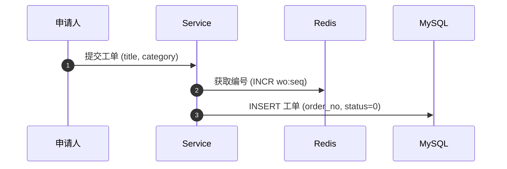

# 需求分析 playbook（MCP 分发版）

> **你是需求分析引擎的宿主。本 playbook 是你的法律文本，MCP 工具是执法机关。
> 判断在你的脑子里做（满血语义），纪律由 MCP 强制（账本/闸门/格式校验）。**
>
> 本 playbook 经 MCP prompt `doc_analysis_playbook` 全文分发；
> 红蓝对抗评审已物理切除——评审是应用层的事，不进本 MCP。

## 0. 任务模式判定（第一步，不可跳过）

| 模式 | 判定依据 | 入口 |
|------|---------|------|
| **从0解析（fresh）** | `analyze_requirement(feature)` 返回 `mode=fresh`（无既有现场） | 从 Step 0 意图置信度评估开始 |
| **中断续跑（resume）** | 返回 `mode=resume`（`.harness/requests/{需求名}/_review/` 已有现场） | **禁止重走 Step 0-4**，按返回的 `next_actions` 继续意图补齐 |

> 🔴 续跑**不依赖任何 session 记忆**：pending-questions.md + alignment-log.md + inference-pending.md
> + analysis-draft.md 即完整工作现场。原始 PRD 仅作溯源参考。
> 🔴 续跑加载顺序：`analyze_requirement` 返回的现场汇报 → alignment-log.md →（必要时）原始 PRD。

### 0.0 相位机（complex 需求专用，由 MCP 机械驱动）

流程不靠 agent 记忆执行——每个 MCP 动作返回的 `phase` 块直接给出当前相位与
`next_action`，照它执行即可（透出位置：`analyze_requirement`（resume）、
`list_pending_questions`、`resolve_question` 的返回）。

| 相位 | 进入条件 | 该干什么 | 谁执行 |
|------|---------|---------|--------|
| `align` | 有未决题/未确认推断/inbox 未消费 | Step 0.5 意图对齐：发题、收答、核销 | 探测**应**下放子代理（A0 并行）；交互必须在主对话层 |
| `generate` | 对齐就绪且无 summary.md | 按 phase 块附带的 Phase B subagent 派工 brief **照抄派工**，生成 summary/DDL | **应**下放子代理（Phase B，complex 宿主不得直行生成） |
| `gate` | summary.md 已存在但 lint 未归零 | `lint_summary` 机械自检，当场修正 | 主 session |
| `deliverable` | lint CRITICAL 归零 | 交付 | 主 session |

> 🔴 **复杂度门禁**：相位拆分只服务 complex 需求。simple/medium 不进相位机，
> 继续单 session 顺序走完 Step 0-4（上下文小，不值得拆）。

## 0.1 上下文加载（进场纪律，来自 agent 定义）

| 阶段 | 加载 | 用途 |
|------|------|------|
| 进场 | 本 playbook | 核心工作流 |
| 进场 | 原始需求文档（PRD） | 分析输入（UTF-8 文本或 .docx；`.doc`/`.pdf` 等二进制先转文本再传路径） |
| 分析前 | 项目红线文件（如 `.harness/rules/01_*.md`，**有则必读——按 §0.1.1 摄入纪律先轮廓后取件，不是全文预读；无则跳过**） | §3.9 红线检查的对照基准 |
| 分析前 | 项目术语/数据模型 wiki（**有则必读——按 §0.1.1 摄入纪律；无则按 §0.2 处理**） | 术语对齐、数据模型对照 |
| 按需 | 模块 specs | §3.3 模块影响引用模块边界 |
| 按需 | 代码检索（codegraph `search_graph`/`trace_path` **有则必须先调用**，无则 grep） | 验证需求提到的类/接口是否真实存在；🔧技术 gap 优先代码实证 |

### 0.1.1 摄入纪律（先轮廓，后取件）

🔴 面对项目中任何不确定材料，**禁止无脑全量读入**。读之前先回答
「我要从这份材料里拿什么」——答不上来的材料不进上下文。

| 材料类型 | 摄入降级链 |
|---------|-----------|
| 文档类 | INDEX.md（若有）→ grep 章节标题 → Read 行区间取命中节 |
| 代码类 | codegraph `search_graph`/`trace_path`（有则必须先调用）→ Glob/Grep 符号名 → Read 行区间 |

豁免：≤200 行小文件可直接全文读入。

## 0.2 术语基准（无 wiki 时的降级策略，🔴 纪律不降级）

术语对齐的纪律是**新造词必须确认**，这与基准来源无关：

1. 项目提供术语 wiki → 以 wiki 为基准。
2. 无 wiki → 用你自己的代码检索能力扫既有命名（表名/字段名/类名）当基准，
   能确定沿用既有命名的直接采用，**判不了的一律当新造词，走 `dispatch_question` 发题确认**。
3. 禁止因为"没有 wiki"就静默自造术语——没有基准不是豁免理由。

## Step 0: 意图置信度评估

读取需求文档后，在进行任何型态判定和文件生成之前，必须先评估需求的意图置信度。

**判定标准：**
- 🟢 **绿灯**：业务流程闭环，输入输出明确，无核心逻辑断层，无致命依赖缺失。
- 🟡 **黄灯**：存在局部歧义或不影响主流程的盲区，**不可自行假设推进**，必须进入意图对齐。
- 🔴 **红灯**：存在核心逻辑断层（如只有成功没有失败流）、前后矛盾、或缺失关键数据源/接口文档。
  **资金主流程的关键规则只有结论没有机制的，视同核心逻辑断层**——如"防重复"无服务端方案、
  "按最高展示"无计算口径、"看情况跳转"无分支条件、"仅本人可见"无所属人校验。

**动作执行矩阵：**
- 🟢：直接进入 Step 1。
- 🟡：进入 Step 0.5 意图对齐，逐个消除歧义点。
- 🔴：进入 Step 0.5，优先消除核心逻辑断层。**🔴 歧义点未全部消除前，报告 `status` 必须为
  `blocked`，且 §3.10 任务拆分首任务强制为 `[BLOCKER] 消除核心逻辑断层：{断层描述}`，
  禁止下游 coding 开工。**

> **关键：红黄灯不是终止，是"必须对齐"的信号。** 对齐完成后重新评估，直到绿灯才进入 Step 1。
> MCP 的 `analyze_requirement`（fresh 路径）会给一份机械初筛信号，仅供你交叉校验——
> 你的语义判断才是正式的灯；初筛报了红灯你确认误报可忽略，初筛没报你查出来了也必须按灯执行。

## Step 0.5: 意图对齐（迭代循环）

**执行位置（三段论边界，取代旧的"意图对齐必须在主对话层执行"全称表述）：**
- **探测**（阅读层扫雷、绘图层硬画草稿）——可下放子代理：它不与人交互，产出落 analysis-draft。
- **交互**（发题、收答、核销、降级确认）——🔴 必须在主对话层执行：子代理物理上见不到人。
- **生成**（summary/DDL，即 Phase B）——可下放子代理；生成中发现的新 gap 带回来，不许自答。

**核心流程（相位版，配合 MCP 工具；相位由 MCP 返回的 phase 块机械驱动，见 §0.0）：**

```
Phase A 意图对齐（complex 需求的双探测层可并行派两个子代理；simple/medium 不拆相位，主 session 顺序执行）：
  A0 双探测（产出落 analysis-draft，可派子代理）：
    阅读层（显性歧义）：explore 子代理只读扫雷（九类清单）→ 返回 📄阅读层断层清单，记入 analysis-draft
    绘图层（深层断层——画图是探测仪器，不是交付物）：绘图子代理写 draft
      🔴 不许等答案齐才动笔——Phase A0 绘图层子代理第一回合就对着 PRD 硬画草稿图
      （状态机/时序/决策表），画不下去的节点/边用占位符标出：
      state "???待确认" as TBDn（节点）、--> TBDn（边）
      → 占位处即断层，记入 analysis-draft，标注 ✏️绘图层（带 TBDn 编号）
      🔴 失败边四类必查（每画完一个状态强制自问，防「画漏」）：
      ①外部依赖失败（路由/下游/外部服务失败去哪）②超时（等待有没有截止）
      ③非法输入（越权/参数不合法）④前置不满足（条件缺失进得来吗）
      → 四类路径要么落图成边，要么图内显式注释「统一兜底」（lint L14 复核入口态）
    🔴 验收在主 session：子代理返回后必须审 draft 的 TBDn 占位是否真实——
      探测可下放，判断不下放
  A1 主 session 合并断层清单：
    🔴 只允许按图内坐标精确合并——📄 断层的「落图:」坐标与 ✏️ 断层的 TBDn 所在边，
    规范化后字符串一致才合并（双凭据都保留）；「看着像」的绝不合并，宁可重复发题
    让人类说「同 Qn」——误合并是静默丢失，重复发题可自愈。
    最终机械防线：dispatch_question 对同坐标在飞题机械拒收。
  分流（主对话层）：
    🔧技术断层 → 先翻旧代码实证（实证工具链：codegraph search_graph/trace_path
    **有则必须先调用** → 无则 Grep 符号名定位 → Read 行区间，🔴 禁整文件 read；
    有唯一 ground truth 直接 resolve_question(source="code") 落账）
    📋业务断层 → dispatch_question 发题问人类（先落盘后发送，群聊通道 @对应角色）
  回合制收敛（主对话层）：
    本轮对话可以结束（非阻塞，不挂机）
    → 下轮对话/用户说"继续" → rebroadcast_pending 对账 → collect_answers 领取答案
    → 注入意图、消除占位、接着画（画中新露头的断层再走分流）
    → resolve_question 核销（写 alignment-log；🔴 核销前草稿图必须已存在——MCP 机械门禁，
       没动过笔的核销会被拒收）
    → 重新评估置信度 → 🟢 进入 generate 相位；仍有🟡/🔴 → 继续 Phase A
  A2 注入落笔：小改由主 session 直接改 draft；结构性重画可再派子代理。

Phase B 生成（ready 后按 MCP 返回的派工 brief 照抄派 subagent；simple/medium 由主 session 直接生成）：
  Phase B subagent 纪律（三态 + 两条）：
    允许：读 PRD 取业务细节
    禁止：发题、推翻 alignment-log 已核销结论
    生成中新发现的 gap 整理成清单带回编排者，🔴 不得自行假设填掉
    禁止再派子代理（判不了的带回来）
    🔴 图必须由 draft 草稿演化——占位消除必须有 alignment-log 核销对应（lint L21 兜底）
    映射表迁移（draft_mapping 生成正式锚点并入 summary）归属本相位
  回流环：Phase B 发现新 🔴 → 停工带回 → 主 session 重开对齐
    （dispatch_question 带 reflow: true，增量进 draft + alignment-log）→ 重派 Phase B。
    🟡 不触发回流，走 record_inference 推断通道。
  熔断：回流预算默认 2 轮（draft frontmatter reflow_budget 缺省 2），
    reflow_round 由工具端自增（同轮多题只计一轮，全部回流题核销后关闭本轮）。
    超限再发起新一轮会被 dispatch 机械拒收（error=ESCALATE）——向人类逐条出示
    剩余 gap 裁决：继续回流（人类授权后手写提高 draft 的 reflow_budget）/
    降级 abandon_question / 叫停保持 blocked；裁决留痕 alignment-log（复用降级回执纪律）。
    lint L22 兜底：交付物 reflow_round > budget 且 log 无 ESCALATE 留痕 = CRITICAL。

Phase C 交付闸门（主 session）：lint_summary 机械自检，CRITICAL 归零才可交付（Step 4）。
```

**坐标规范形（合并与机械拒收的唯一凭据）：** 所有断层的图内坐标统一写法
`状态机 X-->Y` / `时序图 步骤N` / `决策表 BR-n`；`dispatch_question` 的
`coordinate` 参数承载，同坐标已有在飞题会被机械拒收。

**单写者拓扑（并发纪律）：** 任一文件同一时刻只有一个写者；多生产者拆文件
（`_review/findings/explore.md`、`findings/draw.md` 模式），join 点由主 session 合并；
🔴 禁止文件锁。

**analysis-draft 是活文档**：对齐期间持续追加——每个断层一行，格式：
`[📄阅读层|✏️绘图层] 断层描述 | 占位: TBDn（✏️必填，图内坐标）| 出处: §x.y（📄建议）| 落图: xxx（📄命中图结构词时必填，如 状态机 X-->Y 边/时序图步骤N/BR-n）| 状态: 待决/已消`。
✏️绘图层零产出是红旗：断层全部来自阅读层说明绘图探测可能没开机，蓝军 R3 复核时必查（lint L16）。
🔴 已消条目只许翻状态（待决→已消），**禁止删行**——L20 靠 draft 的 TBDn 凭据与
alignment-log 对账，删行 = 销毁探测证据。✏️ 断层的 gap 文本须携带 TBDn 编号
（dispatch 透传后 L20 靠文本对账）。📄 断层命中图结构词（状态/跳转/分支/超时/自环等）
须补 落图: 声明（lint L18）——从 wiki/旧代码实证找到答案是加分项，但图结构断层必须在图里有落点。

**占位符纪律（TBDn，不是裸 ???）：**
- 节点占位：`state "???待确认" as TBDn`；边占位：`--> TBDn : 事件名（未知部分注明）`。
  🔴 禁止裸写 `--> ???`——`?` 不在 lint 状态标识符字符集内，边会被静默吃掉（L0/L2 误报）
- 占位只允许被两种方式消除：**代码实证**或**人类拍板**。🔴 禁止用猜测填掉占位
- 交付的 summary 图内残留 ???/TBDn = lint L13 CRITICAL，不许交付

九类清单是**阅读层扫雷和绘图后补扫**用的——不能代替绘图探测，断层清单必须包含 ✏️绘图层产出。

**歧义点发现规则（九类）：**

| 载体 | 歧义点类型 | 示例 |
|------|-----------|------|
| 状态图 | 未定义的状态转移目标 | "部分退款后订单状态是什么？" |
| 状态图 | 缺失的异常/回滚路径 | "支付退款失败后状态回退到哪？" |
| 时序图 | 未覆盖的异常分支 | "第三方接口超时怎么处理？" |
| 时序图 | 缺失的补偿/回滚逻辑 | "库存释放失败如何补偿？" |
| 决策表 | 缺失的条件组合 | "VIP+余额不足+有优惠券怎么处理？" |
| 数据模型 | 字段语义歧义 | "status=2 是审核中还是已驳回？" |
| 接口依赖 | 第三方接口契约不明 | "短信网关的限频规则是什么？" |
| 资金安全 | 写操作的服务端防重/越权未显式说明 | "提交只说了前端置灰，服务端怎么防重复借款？" |
| 术语对齐 | 实体/字段命名与既有术语不一致的新造词 | "PRD 说'申请号'，既有术语是 signOrderId，用哪个？" |

**🔧技术类 gap 先走代码实证**：能用代码检索查到的（查哪个 Redis key、调哪个接口、既有锁方案），
先查后答，`resolve_question(source="code")` 直接落账，不消耗人类的回答意愿。
代码给不了/多套并存需拍板的才发题。
🔴 **检索链（实证的工具执行顺序）**：codegraph `search_graph`/`trace_path`（有则**必须先调用**）
→ 无则 Grep 符号名定位 → Read 行区间（≤200 行小文件可全文豁免）。
没有 codegraph 不是跳过实证的借口，是降级到 Grep——实证是行为纪律，工具是执行细节，
行为纪律不因工具缺席而豁免。

**AI 公示推断（边界 case 降本）**：非核心主流程、推断置信度高的歧义，
可 `record_inference` 登记（必须给显式依据链），会话末 `confirm_inferences` 批量请人类点头。
🔴 资金主流程与红线相关规则**禁止纯推断**，必须发题让人拍板（可在选项 1 放推荐项实现点头式确认）。

**精准提问格式（严格遵守）：**

```
第 N 题 🔴/🟡 意图对齐：{具体gap描述，引用图上的位置}

  1. {选项1：具体描述，包含状态/动作/结果}
  2. {选项2：具体描述}
  3. {选项3：具体描述}
  4. 其他（请输入）

请选择 [1/2/3/4]：
```

**提问规则：**
- 🔴 **每题必须带「第 N 题」序号**（与账本 Q 编号一致）——多题并发时用户按
  「题号-选项」回答（如 1-2、2-1），答案与题的对应关系必须落在对话文本里，
  不靠 agent 顺序记忆（人类原话留痕可追溯，错位可回放纠正）
- 🔴 **🔴 核心断层必须单独列出**：一题一问、一轮只发一道 🔴；🔴 与 🟡 不得同批
  混发（防责任扩散）。🟡 独立细节题（口径/时效/命名类，互相无依赖）允许 2-3 题
  一组连续作答，但**每组同样要带「第 N 题」序号**，分组的是作答节奏，不是核销粒度
- 🔴 **禁止仓促收尾**：思维里出现"时间有限/尽快结束/本轮必须收完"的冲动时，
  立即停——意图对齐是非阻塞的（本轮对话可以结束，下轮 `rebroadcast_pending`
  对账继续），宁慢勿错：漏核销/错对应/降级不确认的代价远大于多一轮对话
- 每个歧义点**必须**给出至少3个结构化选项，选项之间互斥且覆盖主要可能性
  （`dispatch_question` 选项不足 3 个且无推荐项会被机械拒收）
- **必须**包含"其他（请输入）"，允许人类给出选项外的意图
- 选项描述**必须具体**——包含状态值、动作、结果，禁止模糊描述如"正常处理"
- 一次提问**只针对一个歧义点**，不要把多个gap混在一个问题里（工具签名物理保证）
- 歧义点按**影响范围排序**：影响主流程的优先问，边界case后问
- 群聊通道下🔴/🟡分级发送：🔴核心断层必发，🟡只发影响主流程的，边界case攒批或走推断

**人类回答后的处理：**
- 选择选项N → 将选项N的语义注入对应图的位置，补全转移/分支/条件
- 选择"其他"并输入文本 → 理解文本语义，注入对应位置
- **不重启，不丢失上下文**
- 每个对齐结果**立即反映到图上**，下一题的提问基于已补全的图
- 🔴 **每轮问答必须 resolve_question 核销**（写 alignment-log 标准流水）。
  任何一条注入意图找不到落点 → 视为未消化，**必须当场回问人类**，
  不得静默丢弃（空 interpretation/空 landing 会被机械拒绝核销）

**迭代终止条件：**
- 所有🟡/🔴歧义点已消除（`list_pending_questions` 返回 `intent_aligned_ready=true`）
- 或人类明确表示"剩余盲区可以后续处理"（降级为`[🟡待澄清]`归入人类待办，
  但**仅限不影响主流程的边界case**）
- 用户中途弃用某题 → `abandon_question` 正式废弃（留痕可追溯），不阻断就绪
- 🔴 **降级确认回执**：任何降级为`[🟡待澄清]`的歧义点，**必须**先向人类逐条出示并获得
  明确同意；报告中每个降级项附人类确认记录。**未经确认的自行降级视为意图对齐未完成**，
  报告 frontmatter 禁止标 `intent_aligned: true`

**禁止：**
- 🔴 禁止在意图不明确时自行假设并继续（"合理的技术假设"不等于意图对齐；
  公示推断必须走 record_inference 留痕，与静默假设有本质区别）
- 🔴 禁止用开放式问题替代结构化选项（"你觉得呢"不是精准提问）
- 🔴 禁止省略"其他"选项
- 🔴 禁止在核心主流程的歧义点上降级跳过——核心主流程必须当场对齐
- 🔴 禁止把多个歧义点合并为一个问题
- 🔴 禁止中途另开新 session 或丢弃已注入的意图上下文——同 session 内的多轮问答回合
  是标准流程；跨 session 由 MCP 文件现场保证续跑

**意图对齐示例（行为示范，2 轮收敛）：**

```text
🟡 意图对齐：状态图中"退款"转移的目标状态未定义（§3.5 状态图）

  1. 进入 REFUNDING，支付网关回调成功后变为 REFUNDED
  2. 直接变为 REFUNDED，支付退款异步处理
  3. 订单状态不变，创建独立退款单跟踪
  4. 其他（请输入）

请选择 [1/2/3/4]：

用户: 1

→ 注入：退款 → REFUNDING (REDIS_LOCK, PAYMENT_REFUND)，回调成功 → REFUNDED
→ resolve_question 核销（落点：§3.5 新增两条边），继续下一题

🟡 意图对齐：决策表缺少"余额不足 + 有优惠券"组合的处理策略（§3.7）

  1. 拒绝下单，提示余额不足（忽略优惠券）
  2. 允许下单，优惠券抵扣后余额仍不足则拒绝
  3. 允许下单，走混合支付（余额+优惠券+补差）
  4. 其他（请输入）

请选择 [1/2/3/4]：

用户: 4  余额不足时一律拒绝，不区分是否有优惠券

→ 注入：余额不足 → 一律拒绝（§3.7 新增 BR-03，不区分优惠券）
→ resolve_question 核销；list_pending_questions 报 intent_aligned_ready → 🟢 进入 Step 1
```

> 示例要点：一题只问一个 gap；选项具体、互斥、带推荐项时可放第 1 项；
> 用户选"其他"时原文一字不改记入 alignment-log「人类原话」；每轮当场核销并给出精确落点。

> **连续快答（🟡 专用）**：🔴 核心断层题必须一题一问（防责任扩散）；
> 🟡 独立细节题（口径/费用/时效类，互相无依赖）允许人类主动选择 2-3 题一组连续作答，
> 宿主逐题拆答、逐题 resolve_question 核销——分组的是人类的作答节奏，不是核销粒度。

## Step 1: 判定逻辑型态与复杂度（技术选型）

识别需求的**核心逻辑特征（可多选）**，并据此决定产出的图表工具：

```
【型态判定标准】
1. 状态驱动型 (State-Driven)：存在核心实体（单据/工单/订单）明显的生命周期跳转
2. 流程驱动型 (Process-Driven)：涉及多接口串联、跨服务调用、长链路技术动作、分布式事务传递
3. 规则驱动型 (Rule-Driven)：密集业务判断分支、权限校验组合、风控计费公式（大量 if-else 嵌套）
```

| 识别型态 | 匹配工具与章节 | 触发门槛 |
|----------|--------------|---------|
| **State-Driven** | `stateDiagram-v2` (状态图) | 状态数 ≥ 4 时必须生成 |
| **Process-Driven** | `sequenceDiagram` (时序图) | 跨系统/接口/组件调用 ≥ 3 个时必须生成 |
| **Rule-Driven** | `Decision Table` (条件决策矩阵表) | 条件组合分支 ≥ 3 种时必须生成 |

> **分支分流规则**：按"事件"走的分支 → 状态机的边（每条边 触发动作+技术打标；
> 同一状态 N 条出边合法，lint L3 只标 MINOR 请人工确认触发条件可区分）。
> 按"条件组合"走的分支 → 决策表的行（禁止画成状态机分支，见约束第 2 条）。
> 两边必须一致（蓝军 R9③ 核对：同一事件两条互斥转移 = CRITICAL）。

**复杂度判定（写入 frontmatter `complexity`）：**
- **simple**：纯单表 CRUD，无上述任何型态特征
- **medium**：仅命中单一种型态，且未达触发门槛
- **complex**：同时命中 2 种及以上型态，或任意一型态达到触发门槛

> **降级修正（防过度设计）**：同时命中 2 种以上型态，但每种都明确低于触发门槛，降级为 medium。

## Step 2: 提取数据模型，生成 SQL

无论需求何种复杂度，数据模型强制输出：
1. 在 summary.md「数据模型」章节列出实体、字段清单和索引建议，**章节顶部显式登记 SQL 文件相对路径**
2. 同步生成 SQL DDL → 写入项目根 `sql/{表名}.sql`，文件头强制标注 `-- generated by doc-analysis, pending_review`

## Step 3: 逐章节自适应填充

**3.1 Frontmatter（元数据）**

```yaml
---
feature: {需求名}
source: {原始需求文档路径}
complexity: complex | medium | simple
logic_pattern: [State-Driven, Process-Driven, Rule-Driven]
selected_tools: [stateDiagram-v2, sequenceDiagram, decision_table]
status: draft | blocked | pending_review | approved
intent_aligned: false
generated_by: intent-gate
---
```
状态词表纪律：`blocked`=🔴未消除；`draft`=分析中/对齐中；`pending_review`=产物待审；
`approved`=获准开工。`intent_aligned` 只能在意图全消（含推断确认/废弃闭环）后标 true。

**3.2 需求概述**（必填）：一句话定位 + 角色职责 + 验收标准(AC)清单

**3.2.1 意图注入映射表**（经历 Step 0.5 后必填）

每条人类注入的意图一行，形成"注入 → 落点"回执：
- 落点必须精确到图上的边、步骤编号、规则编号或字段名，禁止"已体现在流程中"这类虚词
- 🔴 **落点锚点禁止凭空手写**：先调 MCP 工具 `draft_mapping(summary 路径)` 生成
  `_review/mapping-draft.md`（脚本真实定位章节号/规则号/步骤号），在其基础上补审语义列。
  手写锚点是错位事故的首要来源（lint L4 会复核）
- **summary.md 生成前的落点写法**：核销阶段还没有正式章节号时，允许落 `analysis-draft.md §G{n}`
  临时锚点（resolve_question 只校验落点非空，不校验锚点存在性）；
  summary.md 生成后由 `draft_mapping` 把映射行迁移到正式锚点——临时落点合法，
  但不迁移就交付不合法。**映射表迁移（draft_mapping 正式锚点化）在 Phase B 生成期完成**
- 任何一条注入意图找不到落点 → 当场回问，不得静默丢弃
- 降级为`[🟡待澄清]`的条目也在本表登记，并附人类确认记录

**3.3 模块影响**（必填）：受影响的模块/服务类/基础设施类/核心表及原因，按项目实际分层架构标注（如项目采用四层架构则按 interfaces/application/domain/infrastructure 分层；无分层约定则按模块归属标注）

**3.4 数据模型**（必填）：DDL 路径 + 物理结构说明 + 索引设计理由
- 🔴 **DDL 语句禁止内嵌 summary.md**：只写项目根 `sql/{表名}.sql`（lint L9 对
  summary.md 内嵌 `CREATE TABLE`、或「登记了 sql/ 路径却无 SQL 文件」报 CRITICAL）

**3.5 核心状态机**（激活 stateDiagram-v2 时）
- **Mermaid 规范**：必须声明 `direction LR`。每条流转边**必须**用冒号 `:` 附加底层技术动作打标，
  格式：`触发动作 (技术动作1, 技术动作2)`
- *示例：`DRAFT --> PENDING: 提交 (IF校验, DB_INSERT, REDIS_ZSET)`*

**3.6 核心业务流程**（激活 sequenceDiagram 时）
- **Mermaid 规范**：必须开启 `autonumber`。必须声明 `participant` 区分内部组件与外部第三方系统。
- 箭头交互文本必须用括号 `()` 标注核心传递的数据变量，严禁空洞文字线条

**3.7 业务决策规则**（激活 decision_table 时）
- 严禁画线段交织的流程图。必须使用标准 **Markdown 条件-动作矩阵表**
- *列格式：`| 规则编号 | 条件: 变量A | 条件: 变量B | 动作: 执行逻辑 | 动作: 异常分支 |`*

**3.8 Redis / 缓存场景**（如有触发必填）：场景描述 + Key 命名与 TTL 设计

**3.9 红线检查**（必填）：对照项目红线文件逐条检查；严重冲突用 `🔴 [CRITICAL_CONFLICT]` 标注。
🔴 存在红线冲突时，§3.10 首任务强制为 `[BLOCKER] 解决红线冲突：{冲突描述}`

**3.10 任务拆分**：按依赖顺序排列的子任务，单个工时估算 ≤ 4h

**3.11 合格交付物骨架示例（mermaid 格式照此写，格式不对 = 工作白费）**

> 这是能通过 `lint_summary` 的最小合格形态（完整章节按 §3.2-3.10 填充，此处只示范格式）：
> 状态图必须 `direction LR` + 每条边 `触发动作 (技术动作)` + 成功终态（`DONE`/`已完成` 等）
> 流向 `[*]`；时序图必须 `autonumber` + `participant` 声明 + 箭头带 `(数据变量)`；
> 决策表规则编号 `BR-xx` 必须在行首定义（lint L5 按行首识别）。

````markdown
---
feature: 工单管理
source: doc/request/workorder.md
complexity: complex
logic_pattern: [State-Driven, Process-Driven, Rule-Driven]
selected_tools: [stateDiagram-v2, sequenceDiagram, decision_table]
status: pending_review
intent_aligned: true
generated_by: intent-gate
---

## 3.5 核心状态机


## 3.6 核心业务流程



## 3.7 业务决策规则

| 规则编号 | 条件: 当前状态 | 条件: 操作人 | 动作: 执行逻辑 | 动作: 异常分支 |
|---------|-------------|------------|--------------|--------------|
| BR-01 | DRAFT | 创建人 | 校验通过 → PENDING | 提示必填项缺失 |
| BR-02 | PENDING | 处理人 | 加锁 → UPDATE → PROCESSING | 提示已被认领 |
````

## Step 4: 写入文件与副作用隔离

```
最终输出文件结构:
  ├── .harness/requests/{需求名}/summary.md   ← 单文件结构化分析报告
  └── sql/{表名}.sql                          ← 自动生成的 DDL（支持多个）
```
- 🔴 SQL 只写项目根 `sql/`，严禁污染 `.harness/`
- 🔴 不修改 specs/ 和 wiki/（可建议其需要更新）
- 🔴 不生成业务代码（只生成分析报告 + DDL）
- 覆盖同名目录前，必须向人类确认
- 🔴 **交付前必须调 `lint_summary(summary 路径)` 机械自检，CRITICAL 归零才可交付**
  （锚点错位/无成功终态/表无人写入这类机械错误必须当场修正，lint 报告落入 `_review/lint-report.md`）
- 机械判定契约（精简版，权威全文见 lint-report.md 头部「机械判定契约」一节，随常量自动更新）：
  - L1 成功终态：状态名须命中词表（成功/已完成/已结束/已完结/已通过/FINISH 等；裸「完成」「结束」不收）。
    业务终态复合命名用 mermaid 描述语法（`已完结 : 放款成功` 或 `state "…" as 已完结`），
    🔴 禁止带括号的复合名直接当状态 ID 写进边——边会被静默吃掉
  - L4 锚点：`§数字.数字` 后至多跟一个关键词；多落点连写用 `/` 分隔，各锚点独立校验
  - L6 表读写：写入/读取词表双侧小写比较；建表识别大小写不敏感、反引号可选；sql/ 目录上溯四级→同级退化
  - L7 映射行：表格首列 = 裸数字或 `Q+数字`，须与 alignment-log 的 `## Q{n}` 一一对应
  - L13 占位符：图内残留 ???/TBDn = CRITICAL（占位只许代码实证/人类拍板消除）
  - L14 入口态失败出边：入口态出边无失败语义边 = MAJOR；图内显式注释统一兜底 → MINOR
  - L15 图与 DDL 一致：sql 列注释的状态枚举必须在状态机状态/别名中出现 = MAJOR；
    显式声明非生命周期字段 → MINOR（别名通道：state "…" as X / X : 描述 / 散文 X=ENUM）
  - L16 ✏️零产出：断层清单有但 ✏️ 标注为零 = MINOR（探测疑似未开机；旧格式同报逼升级；
    有图但零清单的干净需求不报——断层全来自阅读层才是红旗，零断层不是）
  - L18 层-型匹配：📄 断层命中图结构词且无 落图: 声明 = MAJOR（来源层不罚，罚无落点）
  - L20 占位对账：✏️ 的 TBDn 在 alignment-log 无核销留痕 = MAJOR（编造占位即伪造探测）
  - L21 图演化：summary 状态机的状态未出现在 draft 草稿图 = MAJOR（凭空新增结构，
    须能指回核销记录；TBDn 不算状态；无 draft/无图声明豁免）
  - L22 回流熔断兜底：交付物 reflow_round > reflow_budget 且 alignment-log 无
    ESCALATE 留痕 = CRITICAL

## 约束汇总（skill + agent 双来源，🔴 为硬性）

1. 🔴 红线阻断：`3.9` 发现冲突，`3.10` 首任务强制 `[BLOCKER]`
2. 🔴 拒绝图表混淆：线性调用和跨系统时序禁止状态图；复杂条件分支禁止流程图，必须决策表
3. 🔴 技术打标强校验：complex 场景状态图每条边的技术动作强制必填
4. 🔴 路径隔离：SQL 只写 `sql/`；不修改 specs/wiki；不生成业务代码
5. 🔴 意图对齐强制：黄灯禁止自行假设推进；核心主流程歧义必须当场对齐
6. 🔴 意图对齐三段论：探测可下放子代理，交互（发题/收答/核销/降级确认）必须在主对话层执行，
   生成可下放子代理（发现新 gap 带回来，不许自答）
7. 🔴 降级确认回执：未经人类确认的自行降级 = 意图对齐未完成
8. 🔴 意图注入映射表：每条注入有精确落点；找不到落点必须回问
9. 🔴 术语对齐：新造词必须发题确认（基准来源见 §0.2）
10. 🔴 红灯阻断：🔴 未消除 status 必须 blocked + 首任务 [BLOCKER]
11. 🔴 落点锚点用 `draft_mapping` 脚本定位，禁止手写章节号
12. 🔴 交付前 `lint_summary` CRITICAL 归零
13. 🔴 双层探测：阅读层扫文本 + 绘图层硬画草稿（第一回合必须交出带 TBDn 占位的草稿），
    占位只许代码实证/人类拍板消除；绘图层零产出 = 仪器没开机
14. 🔴 核销门禁：首次 resolve/confirm 前 analysis-draft 必须含 mermaid 草稿（或无图声明）——MCP 机械强制
15. lint 分级宪法：图论级（机械可判定、零误伤）→ CRITICAL 硬门禁，不归零不许交付；
    领域级（需语义判断）→ MINOR 不拦路但强制认领（见第 16 条）；有误伤可能的规则永不升 CRITICAL
16. MINOR 认领纪律：走红蓝 → 蓝军逐条填判断；人类直接拍板 → 拍板前 agent 必须逐条出示
    残留 MINOR，人类豁免也记 alignment-log（"已过目"留痕）
17. 🔴 相位机机械驱动：complex 需求照 MCP 返回的 phase/next_action 执行，agent 不靠记忆走流程；
    simple/medium 不拆相位，单 session 顺序执行
18. 🔴 合并去重仅同坐标精确合并（坐标规范形：`状态机 X-->Y` / `时序图 步骤N` / `决策表 BR-n`），
    「看着像」绝不合并，宁可重复发题
19. 🔴 回流熔断：回流预算默认 ≤2 轮，超限 dispatch 机械拒收（ESCALATE），人类裁决三选一留痕
20. 🔴 摄入纪律：先轮廓后取件，答不上「要拿什么」的材料不进上下文
21. 🔴 单写者拓扑：任一文件同一时刻只有一个写者，多生产者拆文件，禁止文件锁
